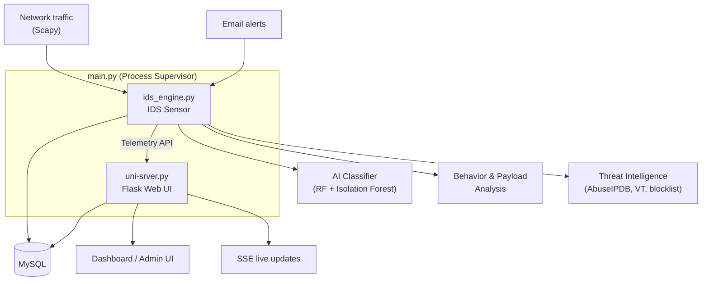

# Enterprise AI IDS

An AI-powered Intrusion Detection System (IDS) with a Flask web dashboard, real-time packet analysis, machine-learning classification, and threat-intelligence enrichment. Built as a modular Python platform suitable for network security monitoring and SOC workflows.

**Author:** Kamal Khalilov  
**Version:** 1.0.0  
**Repository:** [github.com/kamalx06/ids-bachelor-thesis](https://github.com/kamalx06/ids-bachelor-thesis)

---

## Features

- **Real-time packet capture** — Live traffic sniffing via Scapy with configurable BPF filters and worker pools
- **Hybrid AI scoring** — Random Forest + Isolation Forest models trained on CIC IDS–style features, combined with behavioral heuristics and payload analysis
- **Behavioral detection** — Port scans, floods, DNS tunneling, and HTTP payload inspection
- **Threat intelligence** — AbuseIPDB, VirusTotal, IP geolocation, and a local IP blocklist (`config/blocklist_ips.txt`)
- **Zeek correlation** — Optional enrichment from Zeek connection logs
- **Web dashboard** — Live statistics, log search, traffic charts, and Server-Sent Events (SSE) updates
- **Alerts** — Rate-limited email notifications for dangerous traffic bursts
- **Secure authentication** — Argon2 password hashing, TOTP, email OTP, role-based access, and admin user management
- **Persistence** — MySQL for logs and statistics; SQLite for ML training samples
- **Observability** — Prometheus metrics at `/metrics` and IDS health endpoints
- **Resilient architecture** — IDS engine and web UI run as separate OS processes; a sensor crash does not take down the dashboard

---

## Architecture



| Component | Role |
|-----------|------|
| `main.py` | Bootstraps the database and supervises both processes |
| `ids_engine.py` | Packet capture, AI analysis, persistence, telemetry sender |
| `uni-srver.py` | Flask web UI, authentication, dashboard APIs |
| `ai/` | ML training, inference, and model retraining |
| `engine/` | Sniffer, flow management, HTTP/DNS/payload parsers |
| `ids/` | Packet queues, workers, metrics, AI analysis orchestration |
| `intelligence/` | Reputation lookups, Zeek integration, sensor heartbeat |
| `storage/` | MySQL/SQLite persistence, models, migrations |
| `alerts/` | Email alerting for high-risk bursts |
| `api_client/` | IDS → server telemetry over HTTP(S) |

## Running Components

| Command | Description |
|---------|-------------|
| `python main.py` | **Recommended** — supervisor runs Web UI + IDS engine |
| `python ids_engine.py` | IDS sensor only (capture, AI, persistence) |
| `python uni-srver.py` | Web UI only |
| `python bootstrap_db.py` | Database setup only |
| `python retrain_model.py` | Retrain ML models from collected samples |

After `pip install -e .`, console scripts are also available:

| CLI | Equivalent |
|-----|------------|
| `ai-ids` | `python main.py` |
| `ai-ids-web` | `python uni-srver.py` |
| `ai-ids-engine` | `python ids_engine.py` |
| `ai-ids-bootstrap-db` | `python bootstrap_db.py` |
| `ai-ids-retrain` | `python retrain_model.py` |

> **Note:** Packet capture typically requires elevated privileges on Linux:
> `sudo python ids_engine.py` or `sudo ai-ids-engine`

---

## Configuration

Copy `env-example` to `.env`. Key settings:

### Application & Web UI

| Variable | Description |
|----------|-------------|
| `FLASK_SECRET` | Flask session secret |
| `WEB_UI_SSL` | `true` = HTTPS on port 5000 with ad-hoc cert (default) |
| `LOG_LEVEL` | Logging level (`INFO`, `DEBUG`, etc.) |

### MySQL

| Variable | Description |
|----------|-------------|
| `MYSQL_HOST`, `MYSQL_PORT` | Database host and port |
| `MYSQL_USER`, `MYSQL_PASSWORD` | Credentials |
| `MYSQL_DB` | Database name |
| `IDS_BOOTSTRAP_ADMIN_USER` | First admin username (only when DB has no users) |
| `IDS_BOOTSTRAP_ADMIN_PASSWORD` | First admin password |

### SMTP (alerts)

| Variable | Description |
|----------|-------------|
| `SMTP_HOST`, `SMTP_PORT` | Mail server |
| `SMTP_USER`, `SMTP_PASSWORD`, `SMTP_FROM` | SMTP auth |
| `ALERT_RECIPIENTS` | Comma-separated alert recipients |

### IDS Sensor

| Variable | Description |
|----------|-------------|
| `SNIFFER_INTERFACE` | Network interface (e.g. `eth0`) |
| `SNIFFER_BPF` | BPF filter (default: `ip`) |
| `IDS_SUSPICIOUS_THRESHOLD` | Risk score for *suspicious* classification (default `0.52`) |
| `IDS_DANGEROUS_THRESHOLD` | Risk score for *dangerous* classification (default `0.78`) |
| `API_URL` | Telemetry endpoint (e.g. `https://localhost:5000/ids`) |
| `IDS_TLS_VERIFY` | Set `false` for self-signed local HTTPS |

### IDS Performance Tuning

Optional throughput tuning. Copy values into `.env` or edit `config/ids-performance.env` for local overrides (`ids_engine.py` loads the latter when present).

| Variable | Description |
|----------|-------------|
| `IDS_WORKER_COUNT` | Analysis worker threads (default: CPU count, capped at 16) |
| `IDS_PREPROCESS_WORKERS` | Feature-extraction threads between capture and analysis (default: `min(4, CPU count)`; `0` = inline) |
| `IDS_QUEUE_MAXSIZE` | Max size of the analyzed-packet queue |
| `IDS_RAW_QUEUE_MAXSIZE` | Max size of the raw capture queue |
| `IDS_FLOW_SHARDS` | Sharded locks for concurrent flow tracking (default: `128`) |
| `IDS_BEHAVIOR_SHARDS` | Sharded locks for concurrent behavior tracking (default: `64`) |
| `IDS_PORT_SCAN_THRESHOLD` | Port-scan detection: distinct ports before alert (default: `15`) |
| `IDS_PORT_SCAN_WINDOW` | Port-scan detection: time window in seconds (default: `8`) |
| `IDS_FLOOD_THRESHOLD` | Flood detection: packet count before alert (default: `120`) |
| `IDS_FLOOD_WINDOW` | Flood detection: time window in seconds (default: `3`) |

### Threat Intelligence

| Variable | Description |
|----------|-------------|
| `REPUTATION_KEY` | AbuseIPDB API key |
| `VT_KEY` | VirusTotal API key |
| `TI_BLOCKLIST_PATH` | Path to IP blocklist (default: `config/blocklist_ips.txt`) |
| `ZEEK_LOG` / `ZEEK_LOG_DIR` | Optional Zeek log paths for correlation |

See `env-example` for the full list of tunables.

---

## Machine Learning

Models are trained on [CIC IDS 2017](https://www.unb.ca/cic/datasets/ids-2017.html)–style features from `ai/data/cic_ids.csv`.

| Script | Purpose |
|--------|---------|
| `ai/train_ids_models.py` | Initial training — produces `ai/models/*.pkl` |
| `ai/retrainer.py` / `retrain_model.py` | Retrain from live-collected samples |

Artifacts written to `ai/models/`:

- `rf_model.pkl` — Random Forest classifier
- `iso_model.pkl` — Isolation Forest anomaly detector
- `scaler.pkl` — Feature scaler
- `feature_names.pkl` — Feature column order

If model files are missing at startup, training runs automatically via `ai/train_ids_models.py`.

Classification labels exposed to the dashboard:

- **safe** — Normal traffic
- **suspicious** — Elevated risk score or weak signals
- **dangerous** — High risk score with strong attack indicators

---

## Web Dashboard

| Route | Description |
|-------|-------------|
| `/` | Landing / redirect |
| `/login` | Authentication |
| `/dashboard` | Main SOC dashboard (requires login) |
| `/admin` | User management (admin role) |
| `/settings` | Profile, MFA, password |
| `/ids/health` | IDS sensor health check |
| `/stream` | SSE live event stream |
| `/metrics` | Prometheus metrics |

The dashboard shows real-time log counts, traffic time series, top source IPs, and classification breakdowns. When the IDS engine is offline, the UI reflects an **OFFLINE** sensor state while remaining accessible.

---

## Project Structure

```
project-thesis/
├── main.py                 # Process supervisor entry point
├── ids_engine.py           # IDS sensor process
├── uni-srver.py            # Flask web server
├── bootstrap_db.py         # Database initialization
├── retrain_model.py        # Model retraining CLI
├── requirements.txt
├── setup.py
├── env-example
├── ai/                     # ML training, inference, CIC features
├── alerts/                 # Email burst alerts
├── api_client/             # Sensor → server telemetry
├── config/                 # Blocklists, performance tuning
├── engine/                 # Sniffer, parsers, behavior detection
├── ids/                    # Queues, workers, metrics, AI orchestration
├── intelligence/           # TI, Zeek, sensor process management
├── runtime/                # Entry points and process supervisor
├── scripts/sql/            # MySQL migration scripts
├── static/                 # CSS and JavaScript assets
├── storage/                # DB layer, models, persistence
└── templates/              # HTML templates
```

---

## Security Notes

- Change all default credentials before deploying to production.
- The web UI uses self-signed TLS (`ssl_context="adhoc"`) by default — use a reverse proxy with real certificates in production.
- Packet capture and IDS deployment should follow your organization's network monitoring policies and legal requirements.
- Rate limiting is enabled on the Flask app (`flask-limiter`); local IPs can be whitelisted in `uni-srver.py`.

## Installation

### Requirements

- **Python 3.10-3.13**
- **MySQL Server 8.0+**
- **Linux** (recommended) for packet capture — requires root or `CAP_NET_RAW` / `CAP_NET_ADMIN`
- **Optional:** Zeek, ClamAV (`clamd`), AbuseIPDB and VirusTotal API keys

### 1. Prepare the Test Environment

The application has been tested on **Fedora Server 44**.

Download the ISO from: [Fedora Website](https://fedoraproject.org/server/download/)

Create a virtual machine using a virtualization platform such as **VirtualBox**, **VMware**, or **Virt-Manager (KVM)**.

Allocate sufficient resources:

| Resource | Recommended |
|-----------|------------|
| CPU | 6+ vCPUs |
| Memory | 6 GB+ |
| Storage | 30 GB+ |

After installation, update the operating system and install python3.13:

```bash
sudo dnf update -y
sudo dnf install python3.13 -y
```

To allow a non-root user to capture network packets, grant the required capabilities to the Python interpreter:

```bash
sudo setcap cap_net_raw,cap_net_admin=eip $(readlink -f $(which python3.13))
```

If this step is skipped, the application must run with `sudo`.

---

### 2. Install Python 3 pip

Install Python 3 pip when added capabilities:

```bash
python3.13 -m ensurepip --upgrade
```

Install Python 3 pip with root:

```bash
sudo python3.13 -m ensurepip --upgrade
```

---

### 3. Install and Configure MySQL

Install MySQL Server and start the service:

```bash
sudo dnf install mysql-server -y
sudo systemctl enable --now mysqld
```

Log in as the MySQL root user:

```bash
sudo mysql
```

Create the database and user:

```sql
CREATE DATABASE ids_db_test;

CREATE USER 'test_user'@'localhost' IDENTIFIED BY 'change-me';

GRANT ALL PRIVILEGES ON ids_db_test.* TO 'test_user'@'localhost';

FLUSH PRIVILEGES;
EXIT;
```

Configure the corresponding values in your `.env` file:

```env
MYSQL_HOST=127.0.0.1
MYSQL_PORT=3306
MYSQL_USER=test_user
MYSQL_PASSWORD=change-me
MYSQL_DB=ids_db_test
```
---

### 4. Clone the Repository

```bash
git clone https://github.com/kamalx06/ids-bachelor-thesis.git
cd ids-bachelor-thesis
```

Install the required dependencies with root:

```bash
pip3.13 install -r requirements.txt
```
> If you didnt added capabilities, you may need to prefix the command with `sudo`.

---

### 5. Configure the Environment

Create the environment configuration file:

```bash
cp env-example .env
```

Update `.env` with your MySQL credentials, Flask secret, SMTP settings, and any optional API keys. See [Configuration](#configuration).

---

### 6. Prepare the Dataset

The `cic_ids.csv` dataset is not included in this repository due to GitHub file size limitations.

Download **MachineLearningCSV.zip** from the [CIC IDS 2017 dataset](https://www.unb.ca/cic/datasets/ids-2017.html). Extract its contents into the `ai/MachineLearningCVE` directory, or specify the location of the extracted CSV files as a command-line argument when running the merge script.

Using the default directory:

```bash
python3.13 merge_cic_ids.py
```

Specifying a custom extraction directory:

```bash
python3.13 merge_cic_ids.py <directory>
```

---

### 7. Bootstrap the Application

Train the AI models:

```bash
python3.13 ai/train_ids_models.py
```

Initialize the database, create the tables:

```bash
python3.13 bootstrap_db.py
```

If `IDS_BOOTSTRAP_ADMIN_USER` and `IDS_BOOTSTRAP_ADMIN_PASSWORD` are set in `.env`, an administrator account will also be created for WebUI.

---

### 8. Run the Application

If packet capture capabilities have been granted to the Python interpreter, run:

```bash
python3.13 main.py
```

Otherwise, run the application with root privileges:

```bash
sudo python3.13 main.py
```

Open the dashboard at:

**https://localhost:5000**

> A self-signed TLS certificate is generated automatically for the development environment.