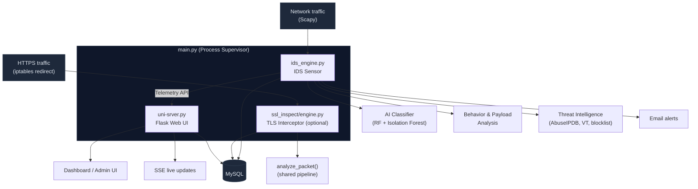

# Enterprise AI IDS

An AI-powered Intrusion Detection System with a Flask web dashboard, real-time packet analysis, hybrid machine-learning classification, threat-intelligence enrichment, optional NGFW-style TLS interception, and a threat-analytics layer for recurring-pattern detection. Built as a modular Python platform suitable for network security monitoring and SOC workflows.

[](https://www.python.org/)
[](#license)

**Author:** Kamal Khalilov  
**Version:** 1.1.0  
**Repository:** [github.com/kamalx06/ids-bachelor-thesis](https://github.com/kamalx06/ids-bachelor-thesis)

---

## Table of Contents

- [Features](#features)
- [Architecture](#architecture)
- [Quick Start](#quick-start)
- [Configuration](#configuration)
- [Machine Learning](#machine-learning)
- [TLS Interception (SSL Decryption)](#tls-interception-ssl-decryption)
- [Threat Analytics](#threat-analytics)
- [Web Dashboard](#web-dashboard)
- [Project Structure](#project-structure)
- [Installation](#installation)
- [Running](#running)
- [Security Notes](#security-notes)
- [Troubleshooting](#troubleshooting)
- [License](#license)

---

## Features

- **Real-time packet capture** — Live traffic sniffing via Scapy with configurable BPF filters, preprocess pipelines, and sharded worker pools.
- **Hybrid AI scoring** — Random Forest + Isolation Forest trained on CIC IDS 2017-style features, fused with behavioral heuristics, payload analysis, and threat-intel verdicts.
- **Behavioral detection** — Port scans, floods, DNS tunneling, HTTP payload inspection, and per-source rate anomalies.
- **Threat intelligence** — AbuseIPDB, VirusTotal, ip-api metadata, and a local IP blocklist (`config/blocklist_ips.txt`) with a MySQL-backed TTL cache.
- **Zeek correlation** *(optional)* — Enrichment from Zeek `conn.log`, `notice.log`, and `weird.log` with rotation-tolerant tail reads.
- **TLS interception** *(optional)* — NGFW-style HTTPS decryption via mitmproxy, with a web-UI-managed root CA, per-SNI bypass rules, and full reuse of the existing analysis pipeline on decrypted payloads.
- **Threat analytics** — Aggregated views of recurring attackers, periodic attack patterns, and day-of-week × hour-of-day heatmaps, backed by an hourly aggregation worker.
- **Web dashboard** — Live statistics, log search with advanced filters, traffic charts, and Server-Sent Events (SSE) updates.
- **Alerts** — Rate-limited email notifications for high-risk bursts, deduplicated per source IP.
- **Secure authentication** — Argon2 password hashing, TOTP, email OTP, role-based access control, and admin user management.
- **Persistence** — MySQL 8+ for logs and statistics; SQLite for local ML training samples.
- **Observability** — Prometheus metrics at `/metrics` and structured IDS health endpoints.
- **Resilient architecture** — IDS engine, web UI, and SSL interceptor run as separate OS processes; a sensor crash does not take down the dashboard.

---

## Architecture


```mermaid
flowchart TB
    subgraph supervisor["main.py (Process Supervisor)"]
        WEB["uni-srver.py<br/>Flask Web UI"]
        IDS["ids_engine.py<br/>IDS Sensor"]
        SSL["ssl_inspect/engine.py<br/>TLS Interceptor (optional)"]
    end

    PCAP["Network traffic<br/>(Scapy)"] --> IDS
    HTTPS["HTTPS traffic<br/>(iptables redirect)"] --> SSL
    SSL --> ANALYZE["analyze_packet()<br/>(shared pipeline)"]
    IDS --> ML["AI Classifier<br/>(RF + Isolation Forest)"]
    IDS --> BEH["Behavior & Payload<br/>Analysis"]
    IDS --> TI["Threat Intelligence<br/>(AbuseIPDB, VT, blocklist)"]
    IDS --> MYSQL[(MySQL)]
    SSL --> MYSQL
    IDS -->|"Telemetry API"| WEB
    WEB --> DASH["Dashboard / Admin UI"]
    WEB --> SSE["SSE live updates"]
    WEB --> MYSQL
    IDS --> ALERT["Email alerts"]

    style supervisor fill:#0f172a,stroke:#334155,color:#e2e8f0
    style PCAP fill:#1e293b,stroke:#334155,color:#e2e8f0
    style HTTPS fill:#1e293b,stroke:#334155,color:#e2e8f0
    style MYSQL fill:#1e293b,stroke:#334155,color:#e2e8f0
```

| Component | Role |
|-----------|------|
| `main.py` | Bootstraps the database and supervises all child processes |
| `ids_engine.py` | Packet capture, AI analysis, persistence, telemetry sender |
| `uni-srver.py` | Flask web UI, authentication, dashboard APIs |
| `ssl_inspect/` | Optional TLS interception engine (mitmproxy addon + CA management) |
| `ai/` | ML training, inference, and model retraining |
| `engine/` | Sniffer, flow manager, HTTP/DNS/payload parsers |
| `ids/` | Packet queues, workers, metrics, AI analysis orchestration |
| `intelligence/` | Reputation lookups, Zeek integration, sensor heartbeat |
| `storage/` | MySQL/SQLite persistence, ORM models, migrations, analytics aggregation |
| `alerts/` | Email alerting for high-risk bursts |
| `api_client/` | IDS → web UI telemetry over HTTP(S) |

---

## Quick Start

Assumes MySQL is already running and reachable.

```bash
# 1. Clone and install
git clone https://github.com/kamalx06/ids-bachelor-thesis.git
cd ids-bachelor-thesis
python3.13 -m venv .venv && source .venv/bin/activate
pip install -r requirements.txt

# 2. Configure
cp env-example .env
$EDITOR .env                # set FLASK_SECRET, MYSQL_*, IDS_SENSOR_TOKEN

# 3. Prepare the CIC IDS dataset (see Installation §6 for details)
python merge_cic_ids.py

# 4. Train the initial models
python ai/train_ids_models.py

# 5. Bootstrap the database
python bootstrap_db.py

# 6. Run
sudo python main.py         # or: sudo setcap cap_net_raw,cap_net_admin=eip $(readlink -f $(which python3.13))
```

Open the dashboard at **https://localhost:5000**.

> A self-signed TLS certificate is generated automatically for the development environment.

### Optional extras

```bash
# TLS interception support (adds mitmproxy)
pip install -e ".[ssl]"

# Development tools
pip install -e ".[dev]"
```

---

## Configuration

Copy `env-example` to `.env` and adjust. All configuration is read at process start.

### Application & Web UI

| Variable | Description |
|----------|-------------|
| `FLASK_SECRET` | Flask session secret. Generate with `python -c "import secrets; print(secrets.token_hex(32))"` |
| `WEB_UI_SSL` | `true` = HTTPS on port 5000 with an ad-hoc cert (default) |
| `LOG_LEVEL` | Logging level (`INFO`, `DEBUG`, `WARNING`, `ERROR`) |
| `TRUSTED_PROXIES` | Number of reverse proxies to trust for `X-Forwarded-*` headers (default: `0`) |

### MySQL

| Variable | Description |
|----------|-------------|
| `MYSQL_HOST`, `MYSQL_PORT` | Database host and port |
| `MYSQL_USER`, `MYSQL_PASSWORD` | Credentials |
| `MYSQL_DB` | Database name |
| `IDS_BOOTSTRAP_ADMIN_USER` | First admin username (only created when DB has no users) |
| `IDS_BOOTSTRAP_ADMIN_PASSWORD` | First admin password |

### SMTP (alerts + email OTP)

> SMTP is **optional**. It is only required if you enable email alerts or email-based OTP.

| Variable | Description |
|----------|-------------|
| `SMTP_HOST`, `SMTP_PORT` | Mail server |
| `SMTP_USER`, `SMTP_PASSWORD`, `SMTP_FROM` | SMTP auth and sender address |
| `ALERT_RECIPIENTS` | Comma-separated alert recipients |

### IDS Sensor

| Variable | Description |
|----------|-------------|
| `SNIFFER_INTERFACE` | Network interface (e.g. `eth0`) |
| `SNIFFER_BPF` | BPF filter (default: `ip`) |
| `IDS_SUSPICIOUS_THRESHOLD` | Risk score for *suspicious* classification (default: `0.52`) |
| `IDS_DANGEROUS_THRESHOLD` | Risk score for *dangerous* classification (default: `0.78`) |
| `API_URL` | Telemetry endpoint (e.g. `https://localhost:5000/ids`) |
| `IDS_TLS_VERIFY` | Set `false` for self-signed local HTTPS |
| `IDS_SENSOR_TOKEN` | Shared secret required by `/ids/update`. Must match on both `ids_engine.py` and `uni-srver.py` |

### IDS Performance Tuning

Optional throughput tuning. Copy values into `.env` or edit `config/ids-performance.env` for local overrides (`ids_engine.py` loads the latter when present).

| Variable | Description |
|----------|-------------|
| `IDS_WORKER_COUNT` | Analysis worker threads (default: CPU count, capped at 16) |
| `IDS_PREPROCESS_WORKERS` | Feature-extraction threads between capture and analysis (default: `min(4, CPU count)`; `0` = inline) |
| `IDS_QUEUE_MAXSIZE` | Max size of the analyzed-packet queue (default: `25000`) |
| `IDS_RAW_QUEUE_MAXSIZE` | Max size of the raw capture queue (default: `10000`) |
| `IDS_FLOW_SHARDS` | Sharded locks for concurrent flow tracking (default: `128`) |
| `IDS_BEHAVIOR_SHARDS` | Sharded locks for concurrent behavior tracking (default: `64`) |
| `IDS_PORT_SCAN_THRESHOLD` | Port-scan detection: distinct ports before alert (default: `15`) |
| `IDS_PORT_SCAN_WINDOW` | Port-scan detection: time window in seconds (default: `8`) |
| `IDS_FLOOD_THRESHOLD` | Flood detection: packet count before alert (default: `120`) |
| `IDS_FLOOD_WINDOW` | Flood detection: time window in seconds (default: `3`) |

### Threat Intelligence

| Variable | Description |
|----------|-------------|
| `REPUTATION_KEY` | AbuseIPDB API key |
| `VT_KEY` | VirusTotal API key |
| `IPAPI_ENABLED` | Enable ip-api.com metadata lookups (default: `true`) |
| `TI_BLOCKLIST_PATH` | Path to IP blocklist (default: `config/blocklist_ips.txt`) |
| `ZEEK_LOG` / `ZEEK_LOG_DIR` | Optional Zeek log paths for correlation |
| `ZEEK_NOTICE_LOG` / `ZEEK_WEIRD_LOG` | Optional explicit notice/weird log paths |

### TLS Interception *(optional)*

Requires the `ssl` extra: `pip install -e ".[ssl]"`.

| Variable | Description |
|----------|-------------|
| `SSL_DECRYPTION_ENABLED` | `true` to start the TLS interceptor alongside the IDS engine (default: `false`) |
| `SSL_INTERCEPT_PORT` | TCP port the interceptor listens on (default: `8443`) |
| `SSL_INTERCEPT_HOST` | Bind address (default: `0.0.0.0`) |

See `env-example` for the full list of tunables.

---

## Machine Learning

Models are trained on [CIC IDS 2017](https://www.unb.ca/cic/datasets/ids-2017.html)-style features merged into `ai/data/cic_ids.csv`.

### Pipeline

Two training paths share the same feature extractor (`ai/cic_features.py`):

| Path | Script | Purpose |
|------|--------|---------|
| **Bootstrap** | `ai/train_ids_models.py` | Initial training from the CIC IDS CSV. Runs automatically at startup if models are missing. |
| **Retrain** | `ai/retrainer.py` / `retrain_model.py` | Retrain from live-collected samples in the `training_data` table. |

The retrainer runs in **full-retrain mode by default**: each cycle reads all accumulated rows from `training_data` and refits the RandomForest from scratch, keeping model quality monotonic with dataset growth. Pass `--incremental` to instead extend the existing forest with new trees (faster on very large datasets, but old trees never see new data).

### Artifacts

Written to `ai/models/`:

- `rf_model.pkl` — Random Forest classifier
- `iso_model.pkl` — Isolation Forest anomaly detector
- `scaler.pkl` — Feature scaler
- `feature_names.pkl` — Feature column order

### Labels

- **safe** — Normal traffic
- **suspicious** — Elevated risk score or weak signals
- **dangerous** — High risk score with strong attack indicators

### Manual retraining

```bash
# Inspect available training samples
python -m ai.retrainer --preview

# Full retrain from all accumulated samples
python -m ai.retrainer

# Extend the current RF instead of retraining
python -m ai.retrainer --incremental

# Seed the training table from a CSV (once)
python -m ai.retrainer --seed-csv ai/data/cic_ids.csv --seed-max-rows 5000 --train
```

---

## TLS Interception (SSL Decryption)

Optional NGFW-style HTTPS decryption. When enabled, TCP/443 traffic is
redirected into a mitmproxy process that terminates TLS, extracts the
plaintext HTTP request, and feeds it through the **same** `analyze_packet()`
pipeline the Scapy sensor uses. Decrypted payloads go through the payload
analyzer, HTTP content checks, and threat-intel lookups; ML classification
is skipped because mitmproxy does not expose the flow-level features the
RandomForest was trained on.

### How it works

1. Enable the feature and install the root CA on the clients you want to inspect.
2. `iptables` redirects inbound TCP/443 into the interceptor (port `8443` by default).
3. mitmproxy presents a per-SNI leaf certificate signed by your root CA.
4. The decrypted request is converted into a packet-shaped dict and passed to `analyze_packet()`.
5. Results are persisted exactly like live sensor events — visible in `/ids/logs`, on the dashboard, and in the analytics aggregation.

### Enabling it

```bash
# 1. Install the mitmproxy dependency
pip install -e ".[ssl]"

# 2. Add the new tables and seed bypass rules
python bootstrap_db.py

# 3. Generate the root CA
python -c "from ssl_inspect.ca import ensure_ca; ensure_ca()"

# 4. Enable in .env
echo 'SSL_DECRYPTION_ENABLED=true' >> .env

# 5. Redirect TCP/443 to the interceptor (as root)
sudo python -m ssl_inspect.iptables install

# 6. Restart the stack
sudo python main.py
```

The web UI at `/ssl` (admin only) lets you:

- Download the root CA (PEM) for client installation.
- Regenerate the CA (destructive — every client must re-install).
- Add, list, and delete SNI / IP / CIDR bypass rules.

### Bypass rules

A conservative bypass list is seeded on first bootstrap, covering
certificate-pinned services (Apple, Google GMS, Mozilla updates, Windows
Update). Add your own at `/ssl`.

Bypass matching:

- `sni` — glob pattern, e.g. `*.example.com`
- `ip` — exact IP match
- `cidr` — network, e.g. `10.0.0.0/8`

### Limitations

- **No ML on decrypted flows.** mitmproxy gives HTTP metadata, not TCP-level flow features. The RandomForest is out of distribution on synthesized features, so the interceptor runs the non-ML detectors only. A `ml_skipped_no_features` reason is attached to every such event.
- **Certificate pinning breaks apps.** Mobile SDKs and some APIs refuse any cert that is not signed by the original issuer. The bypass list mitigates this but is not a cure.
- **Performance.** mitmproxy adds ~5–15% latency per connection and runs on a single event loop. Suitable for a lab or small-office deployment, not for high-throughput production.
- **Legal exposure.** MITM on networks you do not own is illegal in most jurisdictions. The `/ssl` page shows a warning — treat it as a real one.

> **Package naming:** the TLS interception code lives in `ssl_inspect/`, **not** `ssl/`. A top-level package named `ssl` would shadow the Python standard library module and break `requests`, `urllib3`, and mitmproxy on import. Do not rename it back.

---

## Threat Analytics

The `/analytics` page surfaces recurring patterns from historical traffic.

### How it works

A background worker (`storage/analytics.py`) runs every hour in the web UI
process and rewrites the `threat_patterns` table from `packet_logs`,
bucketed four ways:

| Bucket | Retained for | Purpose |
|--------|--------------|---------|
| `hourly` | 14 days | Day-of-week × hour-of-day heatmap |
| `daily` | 180 days | Recurring actor detection, "distinct days active" |
| `weekly` | 3 years | Weekly totals, trend line |
| `monthly` | 10 years | Long-run posture |

Aggregation is idempotent: each run deletes its lookback window and rewrites
it, so running it twice produces identical output.

### What the page shows

- **Weekly totals** — dangerous vs. suspicious per week, stacked bar.
- **Recurring patterns** — cards for actors (IPs or hosts) whose events
  cluster on a single day-of-week. Example: *"1.2.3.4 attacks on Fridays,
  8 weeks running, avg 14 events/week."*
- **Weekly heatmap** — 7×24 grid of dangerous event counts by weekday and hour.
- **Recurring attackers** — table of source IPs seen on 3+ distinct days.
- **Recurring hosts** — same for HTTP hosts / domains.
- **Top threat categories** — ranked reason tokens (`http_SQLi`, `payload_XSS`, etc.).

### Backfill

The hourly worker only fills forward. To populate the page from existing
`packet_logs` on first install:

```bash
python -m storage.analytics --backfill --days 30
```

Run once after deployment. Not on a schedule.

---

## Web Dashboard

| Route | Description |
|-------|-------------|
| `/` | Landing / redirect |
| `/login` | Authentication (password + optional MFA) |
| `/dashboard` | Main SOC dashboard (requires login) |
| `/analytics` | Threat analytics (recurring actors, heatmap, patterns) |
| `/admin` | User management (admin role) |
| `/settings` | Profile, MFA, password |
| `/ssl` | TLS interception management (admin only) |
| `/ids/health` | IDS sensor health check |
| `/ids/stats` | Live statistics (JSON) |
| `/ids/logs` | Paginated log query (JSON) |
| `/ids/search` | Advanced log search (JSON) |
| `/ids/stream` | SSE live event stream |
| `/ids/update` | Sensor telemetry ingest (token-protected) |
| `/analytics/api/*` | Analytics query endpoints |
| `/ssl/api/*` | SSL management endpoints |
| `/metrics` | Prometheus metrics (loopback-only by default; extend `ALLOWED_IPS` in `uni-srver.py` for remote scrapers) |

When the IDS engine is offline, the UI reflects an **OFFLINE** sensor state
while remaining accessible.

---

## Project Structure

```
ids-bachelor-thesis/
├── main.py                 # Process supervisor entry point
├── ids_engine.py           # IDS sensor process (capture, AI, persistence)
├── uni-srver.py            # Flask web server (note: hyphenated filename)
├── bootstrap_db.py         # Database initialization (schema + seed)
├── merge_cic_ids.py        # Merge CIC IDS 2017 CSVs into ai/data/cic_ids.csv
├── retrain_model.py        # Model retraining CLI wrapper
├── requirements.txt
├── setup.py
├── env-example
├── ai/                     # ML training, inference, CIC features
│   ├── models/             # Trained .pkl artifacts (gitignored)
│   ├── data/               # cic_ids.csv (gitignored)
│   ├── classifier.py       # Live inference
│   ├── retrainer.py        # Retraining pipeline
│   └── train_ids_models.py # Bootstrap training
├── alerts/                 # Email burst alerts
├── api_client/             # Sensor → server telemetry
├── config/                 # Blocklists, performance tuning
├── engine/                 # Sniffer, parsers, behavior detection
├── ids/                    # Queues, workers, metrics, AI orchestration
├── intelligence/           # TI, Zeek, sensor process management
├── runtime/                # Entry points and process supervisor
├── ssl_inspect/            # Optional TLS interception (mitmproxy)
│   ├── ca.py               # Root CA generation and metadata
│   ├── bypass.py           # Per-SNI / per-IP bypass rules
│   ├── interceptor.py      # mitmproxy addon — feeds decrypted flows
│   ├── engine.py           # Standalone SSL process launcher
│   └── iptables.py         # Redirect helper (install / remove)
├── static/                 # CSS and JavaScript assets
├── storage/                # DB layer, ORM models, persistence
│   └── analytics.py        # Threat pattern aggregation + query functions
└── templates/              # HTML templates (login, dashboard, admin, settings, analytics, ssl)
```

---

## Installation

### Requirements

- **Python 3.10–3.13**
- **MySQL Server 8.0+**
- **Linux** (recommended) for packet capture — requires root or `CAP_NET_RAW` / `CAP_NET_ADMIN`
- **Optional:** Zeek, ClamAV (`clamd`), AbuseIPDB and VirusTotal API keys, mitmproxy (for TLS interception)

### 1. Prepare the test environment

The application has been tested on **Fedora Server 44**. Similar steps apply on any modern Linux distribution.

Download the ISO from [fedoraproject.org/server/download](https://fedoraproject.org/server/download/), or use your preferred distribution.

Allocate sufficient resources:

| Resource | Recommended |
|----------|-------------|
| CPU | 6+ vCPUs |
| Memory | 6 GB+ |
| Storage | 30 GB+ |

Update the system and install Python 3.13:

```bash
sudo dnf update -y
sudo dnf install python3.13 -y
```

**Grant packet capture capabilities to the Python interpreter.**

> **Security note:** `setcap` on the Python binary grants `CAP_NET_RAW`/`CAP_NET_ADMIN` to *any* script run by that interpreter. This is convenient for development but not ideal in production. For production, use a dedicated service user or apply capabilities to a wrapper.

```bash
sudo setcap cap_net_raw,cap_net_admin=eip $(readlink -f $(which python3.13))
```

If this step is skipped, run the application with `sudo`.

### 2. Install `pip`

```bash
python3.13 -m ensurepip --upgrade
```

If Python was installed system-wide:

```bash
sudo python3.13 -m ensurepip --upgrade
```

### 3. Install and configure MySQL

```bash
sudo dnf install mysql-server -y
sudo systemctl enable --now mysqld
```

Log in as the MySQL root user:

```bash
sudo mysql
```

Create the database and user:

```sql
CREATE DATABASE ids_db_test;

CREATE USER 'test_user'@'localhost' IDENTIFIED BY 'change-me';

GRANT ALL PRIVILEGES ON ids_db_test.* TO 'test_user'@'localhost';

FLUSH PRIVILEGES;
EXIT;
```

Configure the corresponding values in your `.env` file:

```env
MYSQL_HOST=127.0.0.1
MYSQL_PORT=3306
MYSQL_USER=test_user
MYSQL_PASSWORD=change-me
MYSQL_DB=ids_db_test
```

### 4. Clone the repository

```bash
git clone https://github.com/kamalx06/ids-bachelor-thesis.git
cd ids-bachelor-thesis
```

Install the required dependencies:

```bash
pip3.13 install -r requirements.txt
```

> If capabilities were not granted, prefix with `sudo`.

Optionally install as an editable package to expose the `ai-ids*` console scripts:

```bash
pip install -e .

# If you plan to use TLS interception, include the `ssl` extra:
pip install -e ".[ssl]"
```

### 5. Configure the environment

```bash
cp env-example .env
```

Update `.env` with your MySQL credentials, a generated `FLASK_SECRET`, a strong `IDS_SENSOR_TOKEN`, and any optional API keys. See [Configuration](#configuration).

Generate a fresh `FLASK_SECRET`:

```bash
python -c "import secrets; print(secrets.token_hex(32))"
```

### 6. Prepare the dataset

The merged `cic_ids.csv` dataset is **not** included in this repository due to GitHub file size limitations.

1. Download **MachineLearningCSV.zip** from the [CIC IDS 2017 dataset](https://www.unb.ca/cic/datasets/ids-2017.html).
2. Extract the CSVs into `ai/MachineLearningCVE/` (or any directory you prefer).
3. Merge them into a single file:

```bash
python3.13 merge_cic_ids.py                 # uses ai/MachineLearningCVE/
python3.13 merge_cic_ids.py /path/to/csvs   # or specify a custom directory
```

The result is `ai/data/cic_ids.csv`.

### 7. Bootstrap the application

Train the initial models:

```bash
python3.13 ai/train_ids_models.py
```

Initialize the database schema:

```bash
python3.13 bootstrap_db.py
```

If `IDS_BOOTSTRAP_ADMIN_USER` and `IDS_BOOTSTRAP_ADMIN_PASSWORD` are set in `.env`, an administrator account is created automatically on first bootstrap (only when the `users` table is empty).

Optionally backfill the analytics table from existing logs:

```bash
python3.13 -m storage.analytics --backfill --days 30
```

### 8. Run the application

With packet capture capabilities granted:

```bash
python3.13 main.py
```

Or, with root privileges:

```bash
sudo python3.13 main.py
```

Open the dashboard at **https://localhost:5000**.

> A self-signed TLS certificate is generated automatically for the development environment.

---

## Running

| Command | Description |
|---------|-------------|
| `python main.py` | **Recommended** — supervisor runs Web UI + IDS engine (+ SSL interceptor if enabled) |
| `python ids_engine.py` | IDS sensor only (capture, AI, persistence) |
| `python uni-srver.py` | Web UI only |
| `python -m ssl_inspect.engine` | TLS interceptor only |
| `python bootstrap_db.py` | Database setup only |
| `python retrain_model.py` | Retrain ML models from collected samples |

After `pip install -e .`, console scripts are also available:

| CLI | Equivalent |
|-----|------------|
| `ai-ids` | `python main.py` |
| `ai-ids-web` | `python uni-srver.py` |
| `ai-ids-engine` | `python ids_engine.py` |
| `ai-ids-bootstrap-db` | `python bootstrap_db.py` |
| `ai-ids-retrain` | `python retrain_model.py` |
| `ai-ids-ssl-engine` | `python -m ssl_inspect.engine` |

> **Note:** Packet capture typically requires elevated privileges on Linux:
> `sudo python ids_engine.py` or `sudo ai-ids-engine`

### Sensor health

The supervisor writes a heartbeat file and a PID file under `storage/`. The web UI polls these to display the LIVE / OFFLINE indicator on the dashboard. When the IDS engine crashes, the web UI remains up and the sensor status flips to OFFLINE.

---

## Security Notes

- **Change all default credentials** before deploying to production.
- **Generate a strong `FLASK_SECRET`** — never ship the placeholder from `env-example`. Sessions and CSRF tokens depend on it.
- **Set `IDS_SENSOR_TOKEN`** to a long random value. Without it, `/ids/update` rejects all telemetry (returns 503).
- **TLS**: the web UI uses self-signed TLS (`ssl_context="adhoc"`) by default. In production, front it with a reverse proxy (nginx, Caddy) that terminates real certificates. Set `TRUSTED_PROXIES=1` if behind exactly one proxy.
- **`setcap` on the Python interpreter** grants packet-capture capabilities to *every* script that interpreter runs. For production, prefer a dedicated service user or a wrapper entry point that receives the capabilities.
- **Packet capture and IDS deployment** should follow your organization's network monitoring policies and legal requirements.
- **Rate limiting** is enabled on the Flask app (`flask-limiter`). Loopback IPs bypass limits by default; extend `ALLOWED_IPS` in `uni-srver.py` only for trusted internal networks.
- **`/metrics` is loopback-only by default.** If you scrape Prometheus from another host, add its IP to `ALLOWED_IPS`, or place a proxy in front that filters the endpoint.
- **`ip-api.com` free tier is HTTP-only** and can be MITM'd. It contributes only a small weight to final scores; disable with `IPAPI_ENABLED=false` on untrusted networks.
- **TLS interception is a MITM by design.** Only enable `SSL_DECRYPTION_ENABLED=true` on networks you own or have explicit written consent to monitor. Clients must install your root CA — that CA can forge any certificate for any domain, so protect `ssl_inspect/mitm-conf/mitmproxy-ca.pem` (chmod 600) and never commit it to source control.
- **The root CA private key is stored on disk, not in MySQL.** A DB dump alone does not compromise the CA; it only exposes public metadata for the `/ssl` page.

---

## Troubleshooting

### Web UI is unreachable at `https://localhost:5000`

- Confirm `uni-srver.py` is running (`ps aux | grep uni-srver`).
- If you see a self-signed certificate warning, accept it once and reload.
- Check `logs/*.log` for bind errors (port 5000 already in use).

### Dashboard shows OFFLINE even though `ids_engine.py` is running

- Confirm `storage/ids-sensor.pid` and `storage/ids-sensor.heartbeat` exist and are fresh.
- If the heartbeat file is older than `IDS_HEARTBEAT_STALE_SEC` (default 30s), the sensor is considered stalled.
- Check `IDS_SENSOR_TOKEN` matches on both processes.

### Dashboard shows 0 events after a successful startup

- The sensor may not be capturing traffic on `SNIFFER_INTERFACE`. Confirm the interface name.
- Verify the BPF filter (`SNIFFER_BPF`) isn't too restrictive.
- If running without `sudo` and without `setcap`, packet capture will silently fail.

### `ValueError: Expected N features, got M` on the first packet

Model artifacts and `FEATURE_NAMES` are out of sync. Retrain from scratch:

```bash
rm -f ai/models/*.pkl
python ai/train_ids_models.py
```

### Retrainer reports "Not enough training samples"

The `training_data` table accumulates rows as the IDS runs. By default the retrainer needs at least 100 rows. Either let the IDS run longer or seed the table from the CIC IDS CSV:

```bash
python -m ai.retrainer --seed-csv ai/data/cic_ids.csv --seed-max-rows 5000 --train
```

### Email alerts are not sent

- Confirm `SMTP_HOST`, `SMTP_PORT`, `SMTP_USER`, `SMTP_PASSWORD`, and `ALERT_RECIPIENTS` are all set.
- Check `logs/*.log` for `Email alert failed` messages.
- Alerting is rate-limited per source IP. Repeated alerts for the same IP are suppressed for `IDS_BURST_ALERT_DEDUP_SEC` (default 10 minutes).

### Analytics page is empty

- The hourly aggregation worker may not have run yet. Trigger it manually:
  ```bash
  python -m storage.analytics --backfill --days 30
  ```
- Confirm the `threat_patterns` table has rows:
  ```bash
  mysql -u test_user -p ids_db_test -e "SELECT bucket_type, COUNT(*) FROM threat_patterns GROUP BY bucket_type;"
  ```

### SSL interceptor not starting

- Confirm `SSL_DECRYPTION_ENABLED=true` in `.env`.
- Confirm mitmproxy is installed: `python -c "import mitmproxy; print(mitmproxy.__version__)"`.
- Check that port `8443` is free: `ss -tlnp | grep 8443`.
- Look for `SSL interceptor exited` in `logs/*.log`.

### HTTPS sites show certificate warnings after enabling decryption

- The client has not installed the root CA. Download it from `/ssl` and install it on each client.
- See the `/ssl` page for platform-specific install commands.

### SSL decryption interferes with an app

- The app uses certificate pinning. Add its SNI to the bypass list at `/ssl`.
- Common pinned services: Apple, Google GMS, banking apps, some mobile SDKs.

### `AttributeError: module 'ssl' has no attribute ...`

- The project has a top-level `ssl/` package that shadows the stdlib. Rename it to `ssl_inspect/` (see the maintainer note in [TLS Interception](#tls-interception-ssl-decryption)). This is a known Python footgun.

---

## License

Proprietary — © Kamal Khalilov. See the repository for terms.

---

## Acknowledgements

- [CIC IDS 2017](https://www.unb.ca/cic/datasets/ids-2017.html) — training dataset
- [Scapy](https://scapy.net/) — packet capture and parsing
- [scikit-learn](https://scikit-learn.org/) — Random Forest and Isolation Forest
- [Flask](https://flask.palletsprojects.com/) — web framework
- [Chart.js](https://www.chartjs.org/) — dashboard charts
- [Zeek](https://zeek.org/) — optional network analysis
- [mitmproxy](https://mitmproxy.org/) — TLS interception engine