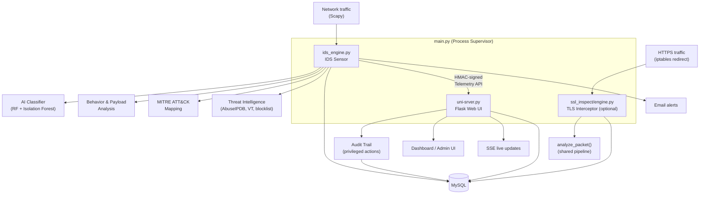

# Enterprise AI based   IDS

An AI-powered Intrusion Detection System with a Flask web dashboard, real-time
packet analysis, hybrid machine-learning classification, threat-intelligence
enrichment, optional NGFW-style TLS interception (via sslsplit), threat
analytics with recurring-pattern detection, an immutable audit trail,
HMAC-signed sensor telemetry, and MITRE ATT&CK-tagged detections. Built as a
modular Python platform suitable for network security monitoring and SOC
workflows.

[](https://www.python.org/)
[](https://www.gnu.org/licenses/gpl-3.0)

**Author:** Kamal Khalilov
**Version:** 1.3.0
**Repository:** [github.com/kamalx06/ids-bachelor-thesis](https://github.com/kamalx06/ids-bachelor-thesis)

---

## Table of Contents

- [Features](#features)
- [Architecture](#architecture)
- [Quick Start](#quick-start)
- [Installation](#installation)
- [Running](#running)
- [Configuration](#configuration)
- [Machine Learning](#machine-learning)
- [TLS Interception (SSL Decryption)](#tls-interception-ssl-decryption)
- [Threat Analytics](#threat-analytics)
- [MITRE ATT&CK Mapping](#mitre-attck-mapping)
- [Audit Log](#audit-log)
- [Signed Sensor Telemetry](#signed-sensor-telemetry)
- [Web Dashboard](#web-dashboard)
- [Project Structure](#project-structure)
- [Security Notes](#security-notes)
- [Troubleshooting](#troubleshooting)
- [License](#license)

---

## Features

- **Real-time packet capture** - Live traffic sniffing via Scapy with configurable BPF filters, preprocess pipelines, and sharded worker pools.
- **Hybrid AI scoring** - Random Forest + Isolation Forest trained on CIC IDS 2017-style features, fused with behavioral heuristics, payload analysis, and threat-intel verdicts.
- **Behavioral detection** - Port scans, floods, DNS tunneling, HTTP payload inspection, and per-source rate anomalies.
- **MITRE ATT&CK mapping** - Every detection is tagged with one or more ATT&CK technique IDs, and the analytics page shows a per-tactic coverage matrix.
- **Threat intelligence** - AbuseIPDB, VirusTotal, ip-api metadata, and a local IP blocklist (`config/blocklist_ips.txt`) with a MySQL-backed TTL cache.
- **Zeek correlation** *(optional)* - Enrichment from Zeek `conn.log`, `notice.log`, and `weird.log` with rotation-tolerant tail reads.
- **TLS interception** *(optional)* - NGFW-style HTTPS decryption via sslsplit, with a web-UI-managed root CA, iptables-enforced SNI bypass for certificate-pinned services, and full reuse of the existing analysis pipeline on decrypted payloads.
- **Threat analytics** - Aggregated views of recurring attackers, periodic attack patterns, and day-of-week x hour-of-day heatmaps, backed by an hourly aggregation worker.
- **Audit log** - Immutable trail of every privileged action (logins, MFA changes, user administration, SSL management, configuration changes), queryable from an admin-only page.
- **Web dashboard** - Live statistics, log search with advanced filters, traffic charts, and Server-Sent Events (SSE) updates.
- **Alerts** - Rate-limited email notifications for high-risk bursts, deduplicated per source IP.
- **Secure authentication** - Argon2 password hashing, TOTP, email OTP, role-based access control, and admin user management.
- **Persistence** - MySQL 8+ for logs and statistics; SQLite for local ML training samples.
- **Signed sensor telemetry** - Every message from the IDS engine to the web UI is authenticated with an HMAC-SHA256 signature over `method/path/timestamp/nonce/SHA256(body)`. The shared secret is never transmitted, replay is prevented by a nonce + timestamp window, and body tampering is detected.
- **Observability** - Prometheus metrics at `/metrics`, structured IDS health endpoints, and an immutable audit trail.
- **Enterprise-tuned rate limiting** - Loopback and authenticated sessions are exempt from default limits; login, MFA, and admin endpoints retain their own per-route throttles.
- **Resilient architecture** - IDS engine, web UI, and SSL interceptor run as separate OS processes; a sensor crash does not take down the dashboard.

---

## Architecture


```mermaid
flowchart TB
    subgraph supervisor["main.py (Process Supervisor)"]
        WEB["uni-srver.py<br/>Flask Web UI"]
        IDS["ids_engine.py<br/>IDS Sensor"]
        SSL["ssl_inspect/engine.py<br/>TLS Interceptor (optional)"]
    end

    PCAP["Network traffic<br/>(Scapy)"] --> IDS
    HTTPS["HTTPS traffic<br/>(iptables redirect)"] --> SSL
    SSL --> ANALYZE["analyze_packet()<br/>(shared pipeline)"]
    IDS --> ML["AI Classifier<br/>(RF + Isolation Forest)"]
    IDS --> BEH["Behavior & Payload<br/>Analysis"]
    IDS --> MITRE["MITRE ATT&CK<br/>Mapping"]
    IDS --> TI["Threat Intelligence<br/>(AbuseIPDB, VT, blocklist)"]
    IDS --> MYSQL[(MySQL)]
    SSL --> MYSQL
    WEB --> AUDIT["Audit Trail<br/>(privileged actions)"]
    AUDIT --> MYSQL
    IDS -->|"HMAC-signed<br/>Telemetry API"| WEB
    WEB --> DASH["Dashboard / Admin UI"]
    WEB --> SSE["SSE live updates"]
    WEB --> MYSQL
    IDS --> ALERT["Email alerts"]
```

| Component | Role |
|-----------|------|
| `main.py` | Bootstraps the database and supervises all child processes |
| `ids_engine.py` | Packet capture, AI analysis, MITRE mapping, persistence, telemetry sender |
| `uni-srver.py` | Flask web UI, authentication, dashboard APIs, audit API |
| `ssl_inspect/` | Optional TLS interception engine (sslsplit launcher + CA management + log reader) |
| `ai/` | ML training, inference, and model retraining |
| `engine/` | Sniffer, flow manager, HTTP/DNS/payload parsers |
| `ids/` | Packet queues, workers, metrics, AI analysis orchestration |
| `intelligence/` | Reputation lookups, Zeek integration, sensor heartbeat, MITRE mapping, HMAC request signing |
| `storage/` | MySQL/SQLite persistence, ORM models, migrations, analytics aggregation, audit trail |
| `alerts/` | Email alerting for high-risk bursts |
| `api_client/` | IDS to web UI telemetry over HTTP(S) |

---

## Quick Start

The short version, assuming MySQL is running and you have not yet cloned the repo:

```bash
git clone https://github.com/kamalx06/ids-bachelor-thesis.git
cd ids-bachelor-thesis
python3 -m venv .venv && source .venv/bin/activate
pip install -e .
cp env-example .env
$EDITOR .env                              # see "Configure the environment" below
python3 merge_cic_ids.py                   # only if you have the CIC-IDS CSVs
python3 ai/train_ids_models.py
python3 bootstrap_db.py
sudo python3 main.py
```

Open **https://localhost:5000**. Accept the self-signed certificate warning once.
Log in with the admin account you configured in `.env`.

For a from-scratch walkthrough, including installing Python, MySQL, and the
packet-capture capability, see [Installation](#installation).

---

## Installation

Six commands. Everything else in this file is about tuning or optional
features, not about getting the app to start.

### Prerequisites

- Linux (any modern distro; tested on Fedora Server 44)
- Python 3.10 - 3.14
- MySQL 8.0+ running and reachable
- `sudo` access once, to grant packet-capture capability

### 1. Install system packages

Pick the block for your distro:

```bash
# Fedora / RHEL
sudo dnf install python3 python3-pip mysql-server -y
sudo systemctl enable --now mysqld

# Debian / Ubuntu
sudo apt update
sudo apt install python3 python3-venv python3-pip mysql-server -y
sudo systemctl enable --now mysql

# Arch
sudo pacman -S python python-pip mysql
sudo systemctl enable --now mysqld
```

### 2. Create the database

```bash
sudo mysql
```

Inside the MySQL prompt:

```sql
CREATE DATABASE ids_db_test;
CREATE USER 'test_user'@'localhost' IDENTIFIED BY 'change-me';
GRANT ALL PRIVILEGES ON ids_db_test.* TO 'test_user'@'localhost';
FLUSH PRIVILEGES;
EXIT;
```

### 3. Clone and install

```bash
git clone https://github.com/kamalx06/ids-bachelor-thesis.git
cd ids-bachelor-thesis
python3 -m venv .venv
source .venv/bin/activate
pip install -e .
```

`pip install -e .` (editable) runs the code directly from this directory.
Every edit you make to the source is picked up immediately, without
reinstalling.

### 4. Grant packet-capture capability

Scapy needs `CAP_NET_RAW` and `CAP_NET_ADMIN` to sniff traffic. Grant them
to the Python interpreter once. After the `source .venv/bin/activate` above,
`which python3` already points at `.venv/bin/python3`, so the following
command targets the right binary:

```bash
sudo setcap cap_net_raw,cap_net_admin=eip $(readlink -f $(which python3))
```

Verify:

```bash
getcap $(readlink -f $(which python3))
# Expected: /path/to/python3 cap_net_raw,cap_net_admin=eip
```

If you want to run the system Python instead of the venv, run the same
command targeting that interpreter's path.

See [Permissions](#permissions) if you prefer the systemd approach or want
to understand the trade-off. The `iptables` sudoers option is there too.

### 5. Configure the environment

```bash
cp env-example .env
```

Edit `.env` and set the values below. Each block is optional but recommended;
the app will start with just the first two.

#### Required

```env
FLASK_SECRET=<generate with: python3 -c "import secrets; print(secrets.token_hex(32))">
IDS_SENSOR_TOKEN=<generate with: python3 -c "import secrets; print(secrets.token_urlsafe(48))">

MYSQL_HOST=127.0.0.1
MYSQL_PORT=3306
MYSQL_USER=test_user
MYSQL_PASSWORD=change-me
MYSQL_DB=ids_db_test
```

#### Bootstrap administrator (recommended)

Set these two to have an administrator created automatically the first time
`python3 bootstrap_db.py` runs. The account is created only when the `users`
table is empty; subsequent runs leave existing accounts untouched.

```env
IDS_BOOTSTRAP_ADMIN_USER=admin
IDS_BOOTSTRAP_ADMIN_PASSWORD=<strong-password-at-least-12-chars>
```

Without these, the database is created with no users and you cannot log in
without manually inserting an admin or re-running the bootstrap after
setting them.

#### Threat-intelligence API keys (recommended)

Both keys enable reputation scoring in the analysis pipeline. Without them
the IDS still runs — it falls back to ip-api.com metadata and the local
blocklist — but it cannot flag IPs and URLs known to the broader community
as malicious.

```env
REPUTATION_KEY=<your-abuseipdb-api-key>
VT_KEY=<your-virustotal-api-key>
```

- AbuseIPDB key: [abuseipdb.com/account/api](https://www.abuseipdb.com/account/api)
- VirusTotal key: [virustotal.com/gui/my-apikey](https://www.virustotal.com/gui/my-apikey)

Keys are read once at startup and cached in MySQL for
`TI_CACHE_TTL_SECONDS` (default 1 hour), so a single key covers many lookups.

#### SMTP (optional — email OTP and burst alerts)

Set these to enable email-based OTP for login and burst alert delivery.
Without them, both features are silently skipped and the rest of the IDS
runs normally.

```env
SMTP_HOST=smtp.gmail.com
SMTP_PORT=587                # STARTTLS. Port 25 = plaintext (internal relay only). Port 465 not supported.
SMTP_USER=<sender@gmail.com>
SMTP_PASSWORD=<app-specific-password>
SMTP_FROM=<sender@gmail.com>

ALERT_RECIPIENTS=<recipient@example.com>
```

`ALERT_RECIPIENTS` is a comma-separated list. Leave it empty to keep SMTP
configured for email OTP while disabling burst alerts.

#### TLS interception (optional)

Set `SSL_DECRYPTION_ENABLED=true` to turn on NGFW-style HTTPS decryption.
This flag alone does not start interception — it must be paired with the
full walkthrough in
[TLS Interception](#tls-interception-ssl-decryption). Leave it `false`
unless you have completed that setup.

```env
SSL_DECRYPTION_ENABLED=false
```

### 6. Train models and bootstrap the database

```bash
python3 ai/train_ids_models.py
python3 bootstrap_db.py
```

The first command requires `ai/data/cic_ids.csv`, which is **not** included
in the repository (GitHub file size limit). See
[Machine Learning](#machine-learning) for how to obtain and merge the CIC
IDS 2017 CSVs. If you already have trained `.pkl` files, copy them into
`ai/models/` and skip the training step.

The second command creates all database tables and — if
`IDS_BOOTSTRAP_ADMIN_USER` and `IDS_BOOTSTRAP_ADMIN_PASSWORD` are set —
provisions the first administrator account.

### Done

Start the stack:

```bash
python3 main.py
```

Open **https://localhost:5000**. Log in with the bootstrap admin account
you configured in step 5. The first launch generates the TLS certificate
and the root CA if they do not exist.

---

## Running

| Command | Description |
|---------|-------------|
| `python3 main.py` | **Recommended** - supervisor runs Web UI + IDS engine (+ SSL interceptor if enabled) |
| `python3 ids_engine.py` | IDS sensor only |
| `python3 uni-srver.py` | Web UI only |
| `python3 -m ssl_inspect.engine` | TLS interceptor only |
| `python3 bootstrap_db.py` | Database setup only |
| `python3 retrain_model.py` | Retrain ML models |

After `pip install -e .` the console scripts below are also available:

| CLI | Equivalent |
|-----|------------|
| `ai-ids` | `python3 main.py` |
| `ai-ids-web` | `python3 uni-srver.py` |
| `ai-ids-engine` | `python3 ids_engine.py` |
| `ai-ids-bootstrap-db` | `python3 bootstrap_db.py` |
| `ai-ids-retrain` | `python3 retrain_model.py` |
| `ai-ids-ssl-engine` | `python3 -m ssl_inspect.engine` |

---

## Configuration

Copy `env-example` to `.env` and adjust. All configuration is read at process start.

### Application & Web UI

| Variable | Description |
|----------|-------------|
| `FLASK_SECRET` | Flask session secret. Generate with `python3 -c "import secrets; print(secrets.token_hex(32))"` |
| `WEB_UI_SSL` | `true` = HTTPS on port 5000 with an ad-hoc cert (default) |
| `LOG_LEVEL` | Logging level (`INFO`, `DEBUG`, `WARNING`, `ERROR`) |
| `TRUSTED_PROXIES` | Number of reverse proxies to trust for `X-Forwarded-*` headers (default: `0`) |
| `RATELIMIT_DEFAULT_HOURLY` | Aggregate hourly rate limit for unauthenticated traffic (default: `5000`). Loopback and logged-in sessions are exempt. |
| `RATELIMIT_DEFAULT_DAILY` | Aggregate daily rate limit for unauthenticated traffic (default: `50000`) |

### MySQL

| Variable | Description |
|----------|-------------|
| `MYSQL_HOST`, `MYSQL_PORT` | Database host and port |
| `MYSQL_USER`, `MYSQL_PASSWORD` | Credentials |
| `MYSQL_DB` | Database name |
| `IDS_BOOTSTRAP_ADMIN_USER` | First admin username. Account is created on the next `bootstrap_db.py` run, but only when the `users` table is empty. |
| `IDS_BOOTSTRAP_ADMIN_PASSWORD` | First admin password. Must meet the same strength rules as user creation (12-64 characters). Rotate it from `/settings` after first login. |

### SMTP (email OTP + burst alerts)

> SMTP is **optional**. It is only required if you enable email-based OTP
> or burst alert delivery. If unset, both features are silently disabled
> and the rest of the IDS runs normally — no error is raised, no log spam.

Two independent features use these credentials:

1. **Email OTP** for login and MFA setup (per-user, enabled from `/settings`)
2. **Burst alert emails** (see [Email burst alerts](#email-burst-alerts) below)

| Variable | Description |
|----------|-------------|
| `SMTP_HOST`, `SMTP_PORT` | Mail server. Port **587** uses STARTTLS and is recommended. Port 25 is plaintext (internal relay only). Port 465 is implicit TLS and is not supported by this client — use 587. |
| `SMTP_USER`, `SMTP_PASSWORD` | SMTP auth credentials. For Gmail, use an app-specific password, not your account password. |
| `SMTP_FROM` | Sender address. Defaults to `SMTP_USER` if unset. |
| `ALERT_RECIPIENTS` | Comma-separated alert recipients. Required for burst alerts; leave empty to disable delivery while keeping SMTP for email OTP. |

### IDS Sensor

| Variable | Description |
|----------|-------------|
| `SNIFFER_INTERFACE` | Network interface (e.g. `eth0`) |
| `SNIFFER_BPF` | BPF filter (default: `ip`) |
| `IDS_SUSPICIOUS_THRESHOLD` | Risk score for *suspicious* classification (default: `0.52`) |
| `IDS_DANGEROUS_THRESHOLD` | Risk score for *dangerous* classification (default: `0.78`) |
| `API_URL` | Telemetry endpoint (e.g. `https://localhost:5000/ids`) |
| `IDS_TLS_VERIFY` | Set `false` for self-signed local HTTPS |
| `IDS_SENSOR_TOKEN` | Shared HMAC secret for signing telemetry POSTs to `/ids/update`. Must match on both `ids_engine.py` and `uni-srver.py`. |
| `IDS_AUTH_MAX_SKEW_SEC` | Maximum tolerated clock difference between sensor and web UI, in seconds (default: `60`). |
| `IDS_AUTH_NONCE_RETENTION_SEC` | How long the server remembers seen nonces (default: `300`). Must be >= `IDS_AUTH_MAX_SKEW_SEC`. |
| `IDS_SERVICE_PORTS` | Comma-separated list of ports the IDS host itself exposes (e.g. `5000`). Traffic to these ports is never flagged as `unusual_port`. |

### IDS Performance Tuning

Optional throughput tuning. Copy values into `.env` or edit
`config/ids-performance.env` for local overrides.

| Variable | Description |
|----------|-------------|
| `IDS_WORKER_COUNT` | Analysis worker threads (default: CPU count, capped at 16) |
| `IDS_PREPROCESS_WORKERS` | Feature-extraction threads (default: `min(4, CPU count)`; `0` = inline) |
| `IDS_QUEUE_MAXSIZE` | Max size of the analyzed-packet queue (default: `25000`) |
| `IDS_RAW_QUEUE_MAXSIZE` | Max size of the raw capture queue (default: `10000`) |
| `IDS_FLOW_SHARDS` | Sharded locks for concurrent flow tracking (default: `128`) |
| `IDS_BEHAVIOR_SHARDS` | Sharded locks for concurrent behavior tracking (default: `64`) |
| `IDS_PORT_SCAN_THRESHOLD` | Port-scan detection: distinct ports before alert (default: `15`) |
| `IDS_PORT_SCAN_WINDOW` | Port-scan detection: time window in seconds (default: `8`) |
| `IDS_FLOOD_THRESHOLD` | Flood detection: packet count before alert (default: `120`) |
| `IDS_FLOOD_WINDOW` | Flood detection: time window in seconds (default: `3`) |

### Threat Intelligence

Enabling threat intelligence requires at least one API key. Both are
optional; without them the IDS still runs and falls back to ip-api.com
metadata and the local blocklist.

| Variable | Description |
|----------|-------------|
| `REPUTATION_KEY` | **AbuseIPDB API key.** Enables IP reputation scoring — malicious IPs lift the fused risk score and add a `reputation_ip_*` reason. |
| `VT_KEY` | **VirusTotal API key.** Enables URL and domain reputation. Adds `reputation_url_*` reasons and can escalate classification to `suspicious` or `dangerous` for known-malicious destinations. |
| `IPAPI_ENABLED` | Enable ip-api.com metadata lookups (default: `true`). No key required, but the free tier is HTTP-only. |
| `TI_BLOCKLIST_PATH` | Path to the local IP blocklist (default: `config/blocklist_ips.txt`). One IP or CIDR per line, `#` for comments. |
| `TI_CACHE_TTL_SECONDS` | Reputation cache lifetime (default: `3600`). Reduces API quota consumption. |
| `TI_MIN_SCORE_FOR_LOOKUP` | Skip TI lookups below this risk score (default: `0.25`). Avoids spending API quota on obviously-benign traffic. |
| `TI_FULL_ENRICH_SCORE` | Perform the full enrichment set above this score (default: `0.45`). |

**Notes on the two key variables.**

- Keys are read once at process start. Adding or changing a key later requires a restart.
- Both providers expose free tiers. AbuseIPDB allows 1,000 checks/day; VirusTotal is rate-limited by minute. The IDS caches every result in MySQL for `TI_CACHE_TTL_SECONDS`, so a modest quota covers a large traffic volume.
- If a key is invalid or the quota is exhausted, the lookup fails closed: the reason token is not added and the event keeps its heuristic-only score. A missing key does not break the pipeline.

### Zeek correlation *(optional)*

| Variable | Description |
|----------|-------------|
| `ZEEK_LOG` / `ZEEK_LOG_DIR` | Optional Zeek log paths for correlation. Leave unset to disable the feature. |
| `ZEEK_NOTICE_LOG` / `ZEEK_WEIRD_LOG` | Optional explicit notice/weird log paths |

### TLS Interception *(optional)*

Requires sslsplit. It is a system binary, not a Python dependency.

| Variable | Description |
|----------|-------------|
| `SSL_DECRYPTION_ENABLED` | **Master switch for TLS interception.** `true` starts the sslsplit interceptor alongside the IDS engine. Setting this alone is not sufficient — the full setup (sslsplit install, root CA, iptables redirect, client-side CA install) is described in [TLS Interception](#tls-interception-ssl-decryption). Default: `false`. |
| `SSL_INTERCEPT_PORT` | TCP port the interceptor listens on (default: `8443`). iptables redirects inbound TCP/443 here. The client never sees this port — the kernel rewrites the destination before the packet reaches sslsplit. |
| `SSL_INTERCEPT_HOST` | Bind address for the interceptor (default: `0.0.0.0`) |
| `SSL_BYPASS_SYNC_SEC` | How often the interceptor reconciles the iptables SNI bypass rules with the database (default: `30`). The web UI also triggers an immediate reconciliation on every rule change. |

### Email burst alerts *(optional)*

Enable: requires `SMTP_*` above and `ALERT_RECIPIENTS` to be set. Without
both, alerts are silently skipped and the IDS runs normally.

Fires when a single source IP generates more than `MIN_EVENTS` dangerous
events within `WINDOW_SEC`. After an alert fires for a given IP, further
alerts for the same IP are suppressed for `DEDUP_SEC`.

The eligibility threshold for "dangerous" shares `IDS_DANGEROUS_THRESHOLD`
above — an event qualifies if it is classified `dangerous` or its fused
risk score crosses that cutoff.

| Variable | Description |
|----------|-------------|
| `IDS_BURST_ALERT_WINDOW_SEC` | Rolling window in seconds (default: `1200`, i.e. 20 minutes) |
| `IDS_BURST_ALERT_MIN_EVENTS` | Threshold within window (default: `10`) |
| `IDS_BURST_ALERT_DEDUP_SEC` | Per-IP suppression after an alert fires (default: `600`, i.e. 10 minutes) |

### Audit & Retention

| Variable | Description |
|----------|-------------|
| `IDS_LOG_RETENTION_DAYS` | Retention for `packet_logs` (default: `7`) |
| Audit retention | Fixed at 180 days in `storage/audit.py`; edit `_AUDIT_RETENTION_DAYS` to change |

See `env-example` for the full list of tunables.

---

## Machine Learning

Models are trained on [CIC IDS 2017](https://www.unb.ca/cic/datasets/ids-2017.html)-style
features merged into `ai/data/cic_ids.csv`.

### Obtaining the dataset

The merged CSV is not shipped with the repository because GitHub rejects
files over 100 MB.

1. Download **MachineLearningCSV.zip** from the
   [CIC IDS 2017 dataset page](https://www.unb.ca/cic/datasets/ids-2017.html).
2. Extract the CSVs into `ai/MachineLearningCVE/`.
3. Merge them:

```bash
python3 merge_cic_ids.py
```

The result is `ai/data/cic_ids.csv`.

### Training

Two paths share the same feature extractor (`ai/cic_features.py`):

| Path | Script | Purpose |
|------|--------|---------|
| **Bootstrap** | `ai/train_ids_models.py` | Initial training from the CIC IDS CSV. |
| **Retrain** | `ai/retrainer.py` / `retrain_model.py` | Retrain from live-collected samples in the `training_data` table. |

The retrainer runs in **full-retrain mode by default**: each cycle reads all
accumulated rows from `training_data` and refits the RandomForest from
scratch. Pass `--incremental` to extend the existing forest instead.

### Artifacts

Written to `ai/models/`:

- `rf_model.pkl` - Random Forest classifier
- `iso_model.pkl` - Isolation Forest anomaly detector
- `scaler.pkl` - Feature scaler
- `feature_names.pkl` - Feature column order

### Labels

- **safe** - Normal traffic
- **suspicious** - Elevated risk score or weak signals
- **dangerous** - High risk score with strong attack indicators

### Manual retraining

```bash
python3 -m ai.retrainer --preview
python3 -m ai.retrainer
python3 -m ai.retrainer --incremental
python3 -m ai.retrainer --seed-csv ai/data/cic_ids.csv --seed-max-rows 5000 --train
```

---

## TLS Interception (SSL Decryption)

### Enabling it

TLS interception is controlled by `SSL_DECRYPTION_ENABLED` in `.env`. When
set to `true`, the supervisor starts an sslsplit process alongside the IDS
engine. But the flag alone does nothing — six things have to be in place:
the sslsplit binary, a root CA on disk, an iptables redirect, a sudoers rule
(if running as a non-root user), the feature flag in `.env`, and the
interceptor process running.

#### 1. Install sslsplit

```bash
sudo dnf install sslsplit -y     # Fedora / RHEL
sudo apt install sslsplit        # Debian / Ubuntu
sudo pacman -S sslsplit          # Arch
```

Verify:

```bash
which sslsplit && sslsplit -V
```

#### 2. Grant the two capabilities

The IDS needs `CAP_NET_RAW` for packet capture and `CAP_NET_ADMIN` for the
NAT rules. Grant them to your Python interpreter once:

```bash
PYTHON=$(readlink -f $(which python3))
sudo setcap cap_net_raw,cap_net_admin=eip "$PYTHON"
```

If you've already done this from [Installation §4](#4-grant-packet-capture-capability),
skip it.

#### 3. Install the sudoers rule for iptables

The `iptables` binary refuses to write NAT rules for non-root callers even
when the process holds `CAP_NET_ADMIN`. To let the IDS manage its own NAT
rules without running the whole supervisor as root, grant passwordless
`sudo` for iptables only.

Open a drop-in sudoers file:

```bash
sudo visudo -f /etc/sudoers.d/ai-ids
```

Replace `YOURUSER` with your actual username, and confirm the path to the
`iptables` binary with `which iptables`:

```
YOURUSER ALL=(root) NOPASSWD: /usr/sbin/iptables, /usr/sbin/iptables *
```

**This grants full firewall administration to `YOURUSER`** — every
`iptables` subcommand, every table, every chain. On a host where the
firewall is a security boundary, replace the single line with the narrower
form documented in [Permissions](#permissions).

Verify the rule works without prompting for a password:

```bash
sudo -n iptables -t nat -L PREROUTING -n
```

If you plan to run the supervisor as `sudo`, skip this step entirely —
root already has access to iptables.

#### 4. Generate the root CA

```bash
python3 -c "from ssl_inspect.ca import ensure_ca; ensure_ca()"
```

The CA private key is written to `ssl_inspect/conf/ids-ca.pem` (chmod 600).
The public certificate is served from `/ssl/api/ca/cert.pem` for client
installation.

#### 5. Enable the feature in `.env`

```bash
echo 'SSL_DECRYPTION_ENABLED=true' >> .env
```

Confirm the line reads `SSL_DECRYPTION_ENABLED=true` — this is the switch
that starts the interceptor process when the supervisor boots.

#### 6. Install the redirect rule

This is the one command that pushes TCP/443 into the interceptor. It's
idempotent — running it twice is safe.

```bash
python3 -m ssl_inspect.iptables install
```

If the sudoers rule from step 3 is in place, this runs as your normal user
without prompting. Otherwise prefix with `sudo`.

The install prints the current state and a hint about excluding the IDS host
itself from interception:

```
[OK] Redirected TCP/443 -> 8443
Hint: exclude the IDS host itself from interception with
      iptables -t nat -I PREROUTING 1 -s <IDS_IP> -j RETURN
```

Run that `-I PREROUTING 1 -s <IDS_IP> -j RETURN` line (with `sudo`) if the
IDS host's own outbound HTTPS should bypass the interceptor — usually the
case, so the IDS can still reach AbuseIPDB and VirusTotal for reputation
lookups.

#### 7. Restart the stack

```bash
python3 main.py
```

If you need root for any other reason (e.g. you skipped steps 2 and 3):

```bash
sudo python3 main.py
```

#### 8. Verify

Three independent checks:

```bash
# a) iptables rule is present
python3 -m ssl_inspect.iptables status
# Should print: [ACTIVE] TCP/443 is redirected to port 8443

# b) sslsplit is listening
ss -tlnp | grep 8443

# c) The connect log starts filling as clients browse
tail -f storage/sslsplit-connect.log
```

Install the root CA on any client that should be inspected — download it
from `/ssl` (admin only) and follow the platform-specific instructions on
that page. Without the CA installed, browsers will show certificate
warnings on every HTTPS site and clients will refuse connections.

#### Managing the interceptor

The web UI at `/ssl` (admin only) lets you:

- **Download the root CA (PEM)** for client installation.
- **Regenerate the CA** — destructive; every client must re-install.
- **Add / delete bypass rules** — SNI, IP, or CIDR patterns that skip
  interception. Changes are picked up by the interceptor within 30 seconds
  (or immediately, if the sudoers rule is in place).

#### Disabling it

```bash
python3 -m ssl_inspect.iptables remove
# then set SSL_DECRYPTION_ENABLED=false in .env and restart
```

### Limitations

- **No ML on decrypted flows.** sslsplit exposes HTTP metadata but no TCP-level flow features.
- **Certificate pinning breaks apps.** Use the SNI bypass list at `/ssl`.
- **Performance.** ~5-15% latency per connection. Suitable for a lab, not high-throughput production.
- **Legal exposure.** MITM on networks you do not own is illegal in most jurisdictions.

> **Package naming:** the TLS interception code lives in `ssl_inspect/`,
> **not** `ssl/`. A top-level package named `ssl` would shadow the Python
> standard library module and break `requests` and `urllib3` on import.

---

## Threat Analytics

The `/analytics` page surfaces recurring patterns from historical traffic.
A background worker runs every hour and rewrites the `threat_patterns` table
from `packet_logs`.

### Backfill

```bash
python3 -m storage.analytics --backfill --days 30
```

Run once after deployment. Not on a schedule.

---

## MITRE ATT&CK Mapping

The mapping is defined in `intelligence/mitre.py` as a `reason token -> technique` dictionary.

### Currently mapped techniques

| Tactic | Techniques |
|--------|------------|
| Initial Access | T1190, T1566 |
| Execution | T1059, T1059.007, T1203 |
| Credential Access | T1552, T1552.005 |
| Discovery | T1046, T1083 |
| Command and Control | T1071, T1071.004, T1105 |
| Impact | T1496, T1498, T1499 |

The coverage page groups these by tactic and marks which have fired in the
observed window.

---

## Audit Log

Every privileged action is written to an immutable `audit_log` table and
exposed through an admin-only `/audit` page.

### What gets audited

| Category | Actions |
|----------|---------|
| Authentication | `login.success`, `login.failure`, `logout`, `auth.unauthorized`, `auth.forbidden`, `rate_limit.exceeded`, `csrf.failure`, `request.rejected` |
| MFA | `mfa.totp.enable`, `mfa.totp.disable`, `mfa.totp.setup_started`, `mfa.totp.qr`, `mfa.email.enable`, `mfa.email.disable`, `mfa.email.login_start` |
| Password | `password.change` |
| Profile | `profile.update` |
| User admin | `user.create`, `user.delete`, `user.set_role`, `user.reset_password`, `user.reset_mfa`, `user.lock`, `user.unlock` |
| SSL management | `ssl.ca_regenerate`, `ssl.bypass.add`, `ssl.bypass.delete` |
| Sensor telemetry | `sensor.auth_failure` |
| Server / routing | `server.error`, `route.not_found` |

Each row captures timestamp, actor ID and username, client IP, action,
target type and ID, outcome (`success` / `failure` / `denied`), and a JSON
detail blob.

---

## Signed Sensor Telemetry

Each request carries three headers: `X-IDS-Timestamp`, `X-IDS-Nonce`, and
`X-IDS-Signature`. The signed payload is:

```
canonical = METHOD \n PATH \n TIMESTAMP \n NONCE \n SHA256(body)
```

The shared secret is used only as the HMAC key. **It is never transmitted on the wire.**

### Server-side checks

1. All three headers must be present.
2. `|server_time - X-IDS-Timestamp| <= IDS_AUTH_MAX_SKEW_SEC`.
3. The HMAC must match, compared with `hmac.compare_digest`.
4. The nonce must be fresh.

---

## Web Dashboard

| Route | Description |
|-------|-------------|
| `/` | Landing / redirect |
| `/login` | Authentication (password + optional MFA) |
| `/dashboard` | Main SOC dashboard (requires login) |
| `/analytics` | Threat analytics + MITRE coverage |
| `/admin` | User management (admin role) |
| `/settings` | Profile, MFA, password |
| `/ssl` | TLS interception management (admin only) |
| `/audit` | Audit trail viewer (admin only) |
| `/ids/health` | IDS sensor health check |
| `/ids/stats` | Live statistics (JSON) |
| `/ids/logs` | Paginated log query (JSON) |
| `/ids/search` | Advanced log search (JSON) |
| `/ids/stream` | SSE live event stream |
| `/ids/update` | Sensor telemetry ingest (HMAC-signed) |
| `/metrics` | Prometheus metrics (loopback-only by default) |

---

## Project Structure

```
ids-bachelor-thesis/
├── main.py                 # Process supervisor entry point
├── ids_engine.py           # IDS sensor process (capture, AI, persistence)
├── uni-srver.py            # Flask web server
├── bootstrap_db.py         # Database initialization (schema + seed)
├── merge_cic_ids.py        # Merge CIC IDS 2017 CSVs into ai/data/cic_ids.csv
├── retrain_model.py        # Model retraining CLI wrapper
├── requirements.txt
├── pyproject.toml          # package metadata (PEP 621)
├── setup.py                # custom build commands only
├── env-example
├── ai/                     # ML training, inference, CIC features
├── alerts/                 # Email burst alerts
├── api_client/             # Sensor to server telemetry
├── config/                 # Blocklists, performance tuning
├── engine/                 # Sniffer, parsers, behavior detection
├── ids/                    # Queues, workers, metrics, AI orchestration
├── intelligence/           # TI, Zeek, sensor process, MITRE, sensor auth
├── runtime/                # Entry points and process supervisor
├── ssl_inspect/            # Optional TLS interception (sslsplit)
├── static/                 # CSS and JavaScript assets
├── storage/                # DB layer, ORM models, persistence
└── templates/              # HTML templates
```

---

## Security Notes

- **Change all default credentials** before deploying to production.
- **Generate a strong `FLASK_SECRET`** - never ship the placeholder from `env-example`.
- **Set `IDS_SENSOR_TOKEN`** to a long random value. Without it, `/ids/update` rejects all telemetry (returns 503).
- **Set a strong bootstrap admin password.** `IDS_BOOTSTRAP_ADMIN_PASSWORD` is stored in plaintext in `.env` until the account is created; rotate it from `/settings` after first login.
- **Sensor telemetry is signed, not bearer-authenticated.** The nonce store is in-process; move it to Redis or MySQL before running multiple web workers.
- **TLS**: the web UI uses self-signed TLS by default. Front it with a reverse proxy in production. Set `TRUSTED_PROXIES=1` if behind exactly one proxy.
- **`setcap` on the Python interpreter** grants packet-capture capabilities to *every* script that interpreter runs. See [Permissions](#permissions) for the systemd alternative.
- **Rate limiting** is enabled. Per-endpoint decorators on `/login` (5/min), `/check_totp` (5/min), and the MFA endpoints remain in force.
- **`/metrics` is loopback-only by default.** Extend `ALLOWED_IPS` in `uni-srver.py` for remote scrapers.
- **`ip-api.com` free tier is HTTP-only** and can be MITM'd. Disable with `IPAPI_ENABLED=false` on untrusted networks.
- **Threat-intelligence API keys (`REPUTATION_KEY`, `VT_KEY`)** are read at process start. Rotate them from the provider dashboards if leaked; the IDS picks up new values on the next restart.
- **SMTP credentials** are stored in plaintext in `.env`. Use an app-specific password (not your account password) and restrict the `.env` file with `chmod 600`.
- **TLS interception is a MITM by design.** Only enable `SSL_DECRYPTION_ENABLED=true` on networks you own or have explicit written consent to monitor. Protect `ssl_inspect/conf/ids-ca.pem` (chmod 600) and never commit it to source control.
- **The audit log is an append-only table by convention.** Wire new privileged actions through `storage.audit.audit()` so they appear in the trail.

---

## Troubleshooting

### Web UI is unreachable at `https://localhost:5000`

- Confirm `main.py` (or `uni-srver.py`) is running: `ps aux | grep main.py`.
- Accept the self-signed certificate warning once.
- Check `logs/*.log` for bind errors.

### Cannot log in after first launch

- Confirm `IDS_BOOTSTRAP_ADMIN_USER` and `IDS_BOOTSTRAP_ADMIN_PASSWORD` were set in `.env` **before** `bootstrap_db.py` ran. If the database was already created without them, re-run `python3 bootstrap_db.py` after setting them — but only if the `users` table is still empty. If it is not, use a one-off SQL insert or reset via the CLI.
- If the admin account exists but the password is rejected, check for whitespace around the value in `.env` (the parser strips quotes but not inner spaces).
- Bootstrap creates the admin only on the first run. To re-seed, empty the `users` table and re-run `bootstrap_db.py`.

### Email OTP or burst alerts never arrive

- Confirm `SMTP_HOST`, `SMTP_PORT`, `SMTP_USER`, `SMTP_PASSWORD`, and `SMTP_FROM` are set. Any of these missing disables both features silently — check `logs/*.log` for a single `Email alerts are disabled` warning.
- For burst alerts, confirm `ALERT_RECIPIENTS` is set and non-empty.
- Check the log for `Email alert failed` — SMTP rejections (invalid credentials, quota, blocked sender) are logged with the SMTP error.
- For Gmail specifically: use an app-specific password, not your account password. Account passwords are rejected when 2FA is enabled on the Google account.
- Port 587 uses STARTTLS and is the only supported mode. Port 25 is plaintext; port 465 is implicit TLS and is not handled by this client.

### Threat-intelligence lookups never run

- Confirm at least one key is set: `REPUTATION_KEY` (AbuseIPDB), `VT_KEY` (VirusTotal), or both.
- Keys are read at process start. Adding them to `.env` while the IDS is running has no effect until you restart.
- Confirm the traffic actually crosses the lookup threshold: `TI_MIN_SCORE_FOR_LOOKUP` (default `0.25`). Benign traffic below the threshold is deliberately skipped.
- Look for HTTP 401/403 in the IDS log — an invalid key is silently skipped for that lookup.
- Confirm quota is not exhausted: AbuseIPDB free tier allows 1,000 checks/day; VirusTotal's free tier is per-minute limited.

### Dashboard shows OFFLINE even though `ids_engine.py` is running

- Confirm `storage/ids-sensor.pid` and `storage/ids-sensor.heartbeat` are fresh.
- Check `IDS_SENSOR_TOKEN` matches on both processes.

### Sensor telemetry is rejected (HTTP 401 from `/ids/update`)

- **`missing_signing_headers`** - sender or receiver out of date. Both sides must be the signed-request version.
- **`bad_signature`** - the two processes have different `IDS_SENSOR_TOKEN` values.
- **`timestamp_out_of_window`** - clocks differ by more than `IDS_AUTH_MAX_SKEW_SEC`. Run NTP.
- **`replayed_nonce`** - a proxy is replaying requests.

### Dashboard shows 0 events after a successful startup

- The sensor may not be capturing on `SNIFFER_INTERFACE`. Confirm the name.
- If running without `sudo` and without `setcap`, packet capture fails silently. See [Permissions](#permissions).

### `ValueError: Expected N features, got M` on the first packet

Model artifacts and `FEATURE_NAMES` are out of sync:

```bash
rm -f ai/models/*.pkl
python3 ai/train_ids_models.py
```

### Retrainer reports "Not enough training samples"

```bash
python3 -m ai.retrainer --seed-csv ai/data/cic_ids.csv --seed-max-rows 5000 --train
```

### Analytics page is empty

```bash
python3 -m storage.analytics --backfill --days 30
```

### SSL interceptor not starting

- Confirm `SSL_DECRYPTION_ENABLED=true` in `.env`.
- Confirm sslsplit is installed: `which sslsplit && sslsplit -V`.
- Confirm port `8443` is free: `ss -tlnp | grep 8443`.
- Check the log for `iptables bypass sync skipped: not running as root`. See [Permissions](#permissions).

### `AttributeError: module 'ssl' has no attribute ...`

A stray top-level `ssl/` folder is shadowing the stdlib. Rename it to `ssl_inspect/`.

---

## License

This project is licensed under the **GNU General Public License v3.0 or later**
(GPL-3.0-or-later). See the [`LICENSE`](LICENSE) file for the full text.

Copyright (C) 2026 Kamal Khalilov

---

## Acknowledgements

- [CIC IDS 2017](https://www.unb.ca/cic/datasets/ids-2017.html) - training dataset
- [Scapy](https://scapy.net/) - packet capture and parsing
- [scikit-learn](https://scikit-learn.org/) - Random Forest and Isolation Forest
- [Flask](https://flask.palletsprojects.com/) - web framework
- [Chart.js](https://www.chartjs.org/) - dashboard charts
- [Zeek](https://zeek.org/) - optional network analysis
- [sslsplit](https://www.roe.ch/SSLsplit) - TLS interception engine
- [MITRE ATT&CK](https://attack.mitre.org/) - technique classification framework