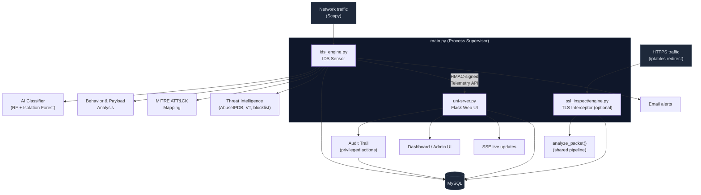

# Enterprise AI IDS

An AI-powered Intrusion Detection System with a Flask web dashboard, real-time packet analysis, hybrid machine-learning classification, threat-intelligence enrichment, optional NGFW-style TLS interception (via sslsplit), threat analytics with recurring-pattern detection, an immutable audit trail, HMAC-signed sensor telemetry, and MITRE ATT&CK–tagged detections. Built as a modular Python platform suitable for network security monitoring and SOC workflows.

[](https://www.python.org/)
[](#license)

**Author:** Kamal Khalilov  
**Version:** 1.3.0  
**Repository:** [github.com/kamalx06/ids-bachelor-thesis](https://github.com/kamalx06/ids-bachelor-thesis)

---

## Table of Contents

- [Features](#features)
- [Architecture](#architecture)
- [Quick Start](#quick-start)
- [Configuration](#configuration)
- [Machine Learning](#machine-learning)
- [TLS Interception (SSL Decryption)](#tls-interception-ssl-decryption)
- [Threat Analytics](#threat-analytics)
- [MITRE ATT&CK Mapping](#mitre-attck-mapping)
- [Audit Log](#audit-log)
- [Signed Sensor Telemetry](#signed-sensor-telemetry)
- [Web Dashboard](#web-dashboard)
- [Project Structure](#project-structure)
- [Installation](#installation)
- [Running](#running)
- [Security Notes](#security-notes)
- [Troubleshooting](#troubleshooting)
- [License](#license)

---

## Features

- **Real-time packet capture** — Live traffic sniffing via Scapy with configurable BPF filters, preprocess pipelines, and sharded worker pools.
- **Hybrid AI scoring** — Random Forest + Isolation Forest trained on CIC IDS 2017-style features, fused with behavioral heuristics, payload analysis, and threat-intel verdicts.
- **Behavioral detection** — Port scans, floods, DNS tunneling, HTTP payload inspection, and per-source rate anomalies.
- **MITRE ATT&CK mapping** — Every detection is tagged with one or more ATT&CK technique IDs, and the analytics page shows a per-tactic coverage matrix.
- **Threat intelligence** — AbuseIPDB, VirusTotal, ip-api metadata, and a local IP blocklist (`config/blocklist_ips.txt`) with a MySQL-backed TTL cache.
- **Zeek correlation** *(optional)* — Enrichment from Zeek `conn.log`, `notice.log`, and `weird.log` with rotation-tolerant tail reads.
- **TLS interception** *(optional)* — NGFW-style HTTPS decryption via sslsplit, with a web-UI-managed root CA, iptables-enforced SNI bypass for certificate-pinned services, and full reuse of the existing analysis pipeline on decrypted payloads.
- **Threat analytics** — Aggregated views of recurring attackers, periodic attack patterns, and day-of-week × hour-of-day heatmaps, backed by an hourly aggregation worker.
- **Audit log** — Immutable trail of every privileged action (logins, MFA changes, user administration, SSL management, configuration changes), queryable from an admin-only page.
- **Web dashboard** — Live statistics, log search with advanced filters, traffic charts, and Server-Sent Events (SSE) updates.
- **Alerts** — Rate-limited email notifications for high-risk bursts, deduplicated per source IP.
- **Secure authentication** — Argon2 password hashing, TOTP, email OTP, role-based access control, and admin user management.
- **Persistence** — MySQL 8+ for logs and statistics; SQLite for local ML training samples.
- **Signed sensor telemetry** — Every message from the IDS engine to the web UI is authenticated with an HMAC-SHA256 signature over `method/path/timestamp/nonce/SHA256(body)`. The shared secret is never transmitted, replay is prevented by a nonce + timestamp window, and body tampering is detected. See [`intelligence/sensor_auth.py`](intelligence/sensor_auth.py).
- **Observability** — Prometheus metrics at `/metrics`, structured IDS health endpoints, and an immutable audit trail.
- **Enterprise-tuned rate limiting** — Loopback and authenticated sessions are exempt from default limits; login, MFA, and admin endpoints retain their own per-route throttles.
- **Resilient architecture** — IDS engine, web UI, and SSL interceptor run as separate OS processes; a sensor crash does not take down the dashboard.

---

## Architecture


```mermaid
flowchart TB
    subgraph supervisor["main.py (Process Supervisor)"]
        WEB["uni-srver.py<br/>Flask Web UI"]
        IDS["ids_engine.py<br/>IDS Sensor"]
        SSL["ssl_inspect/engine.py<br/>TLS Interceptor (optional)"]
    end

    PCAP["Network traffic<br/>(Scapy)"] --> IDS
    HTTPS["HTTPS traffic<br/>(iptables redirect)"] --> SSL
    SSL --> ANALYZE["analyze_packet()<br/>(shared pipeline)"]
    IDS --> ML["AI Classifier<br/>(RF + Isolation Forest)"]
    IDS --> BEH["Behavior & Payload<br/>Analysis"]
    IDS --> MITRE["MITRE ATT&CK<br/>Mapping"]
    IDS --> TI["Threat Intelligence<br/>(AbuseIPDB, VT, blocklist)"]
    IDS --> MYSQL[(MySQL)]
    SSL --> MYSQL
    WEB --> AUDIT["Audit Trail<br/>(privileged actions)"]
    AUDIT --> MYSQL
    IDS -->|"HMAC-signed<br/>Telemetry API"| WEB
    WEB --> DASH["Dashboard / Admin UI"]
    WEB --> SSE["SSE live updates"]
    WEB --> MYSQL
    IDS --> ALERT["Email alerts"]

    style supervisor fill:#0f172a,stroke:#334155,color:#e2e8f0
    style PCAP fill:#1e293b,stroke:#334155,color:#e2e8f0
    style HTTPS fill:#1e293b,stroke:#334155,color:#e2e8f0
    style MYSQL fill:#1e293b,stroke:#334155,color:#e2e8f0
```

| Component | Role |
|-----------|------|
| `main.py` | Bootstraps the database and supervises all child processes |
| `ids_engine.py` | Packet capture, AI analysis, MITRE mapping, persistence, telemetry sender |
| `uni-srver.py` | Flask web UI, authentication, dashboard APIs, audit API |
| `ssl_inspect/` | Optional TLS interception engine (sslsplit launcher + CA management + log reader) |
| `ai/` | ML training, inference, and model retraining |
| `engine/` | Sniffer, flow manager, HTTP/DNS/payload parsers |
| `ids/` | Packet queues, workers, metrics, AI analysis orchestration |
| `intelligence/` | Reputation lookups, Zeek integration, sensor heartbeat, MITRE mapping, HMAC request signing for the telemetry channel |
| `storage/` | MySQL/SQLite persistence, ORM models, migrations, analytics aggregation, audit trail |
| `alerts/` | Email alerting for high-risk bursts |
| `api_client/` | IDS → web UI telemetry over HTTP(S) |

---

## Quick Start

Assumes MySQL is already running and reachable.

```bash
# 1. Clone and install
git clone https://github.com/kamalx06/ids-bachelor-thesis.git
cd ids-bachelor-thesis
python3.13 -m venv .venv && source .venv/bin/activate
pip install -r requirements.txt

# 2. Configure
cp env-example .env
$EDITOR .env                # set FLASK_SECRET, MYSQL_*, IDS_SENSOR_TOKEN

# 3. Prepare the CIC IDS dataset (see Installation §6 for details)
python3.13 merge_cic_ids.py

# 4. Train the initial models
python3.13 ai/train_ids_models.py

# 5. Bootstrap the database
python3.13 bootstrap_db.py

# 6. Run
sudo python3.13 main.py     # or: sudo setcap cap_net_raw,cap_net_admin=eip $(readlink -f $(which python3.13))
```

Open the dashboard at **https://localhost:5000**.

> A self-signed TLS certificate is generated automatically for the development environment.

### Optional extras

```bash
# TLS interception support (system package — not a Python dependency)
sudo dnf install sslsplit -y     # Fedora / RHEL
sudo apt install sslsplit        # Debian / Ubuntu

# Development tools
pip install -e ".[dev]"
```

---

## Configuration

Copy `env-example` to `.env` and adjust. All configuration is read at process start.

### Application & Web UI

| Variable | Description |
|----------|-------------|
| `FLASK_SECRET` | Flask session secret. Generate with `python -c "import secrets; print(secrets.token_hex(32))"` |
| `WEB_UI_SSL` | `true` = HTTPS on port 5000 with an ad-hoc cert (default) |
| `LOG_LEVEL` | Logging level (`INFO`, `DEBUG`, `WARNING`, `ERROR`) |
| `TRUSTED_PROXIES` | Number of reverse proxies to trust for `X-Forwarded-*` headers (default: `0`) |
| `RATELIMIT_DEFAULT_HOURLY` | Aggregate hourly rate limit for unauthenticated traffic (default: `5000`). Loopback and logged-in sessions are exempt. |
| `RATELIMIT_DEFAULT_DAILY` | Aggregate daily rate limit for unauthenticated traffic (default: `50000`) |

### MySQL

| Variable | Description |
|----------|-------------|
| `MYSQL_HOST`, `MYSQL_PORT` | Database host and port |
| `MYSQL_USER`, `MYSQL_PASSWORD` | Credentials |
| `MYSQL_DB` | Database name |
| `IDS_BOOTSTRAP_ADMIN_USER` | First admin username (only created when DB has no users) |
| `IDS_BOOTSTRAP_ADMIN_PASSWORD` | First admin password |

### SMTP (alerts + email OTP)

> SMTP is **optional**. It is only required if you enable email alerts or email-based OTP.

| Variable | Description |
|----------|-------------|
| `SMTP_HOST`, `SMTP_PORT` | Mail server |
| `SMTP_USER`, `SMTP_PASSWORD`, `SMTP_FROM` | SMTP auth and sender address |
| `ALERT_RECIPIENTS` | Comma-separated alert recipients |

### IDS Sensor

| Variable | Description |
|----------|-------------|
| `SNIFFER_INTERFACE` | Network interface (e.g. `eth0`) |
| `SNIFFER_BPF` | BPF filter (default: `ip`) |
| `IDS_SUSPICIOUS_THRESHOLD` | Risk score for *suspicious* classification (default: `0.52`) |
| `IDS_DANGEROUS_THRESHOLD` | Risk score for *dangerous* classification (default: `0.78`) |
| `API_URL` | Telemetry endpoint (e.g. `https://localhost:5000/ids`) |
| `IDS_TLS_VERIFY` | Set `false` for self-signed local HTTPS |
| `IDS_SENSOR_TOKEN` | Shared HMAC secret for signing every telemetry POST to `/ids/update`. Must match on both `ids_engine.py` and `uni-srver.py`. Generate with `python -c "import secrets; print(secrets.token_urlsafe(48))"` |
| `IDS_AUTH_MAX_SKEW_SEC` | Maximum tolerated clock difference between sensor and web UI, in seconds (default: `60`). Increase only if the two hosts are not NTP-synced. |
| `IDS_AUTH_NONCE_RETENTION_SEC` | How long the server remembers seen nonces to detect replay (default: `300`). Must be ≥ `IDS_AUTH_MAX_SKEW_SEC`. |

### IDS Performance Tuning

Optional throughput tuning. Copy values into `.env` or edit `config/ids-performance.env` for local overrides (`ids_engine.py` loads the latter when present).

| Variable | Description |
|----------|-------------|
| `IDS_WORKER_COUNT` | Analysis worker threads (default: CPU count, capped at 16) |
| `IDS_PREPROCESS_WORKERS` | Feature-extraction threads between capture and analysis (default: `min(4, CPU count)`; `0` = inline) |
| `IDS_QUEUE_MAXSIZE` | Max size of the analyzed-packet queue (default: `25000`) |
| `IDS_RAW_QUEUE_MAXSIZE` | Max size of the raw capture queue (default: `10000`) |
| `IDS_FLOW_SHARDS` | Sharded locks for concurrent flow tracking (default: `128`) |
| `IDS_BEHAVIOR_SHARDS` | Sharded locks for concurrent behavior tracking (default: `64`) |
| `IDS_PORT_SCAN_THRESHOLD` | Port-scan detection: distinct ports before alert (default: `15`) |
| `IDS_PORT_SCAN_WINDOW` | Port-scan detection: time window in seconds (default: `8`) |
| `IDS_FLOOD_THRESHOLD` | Flood detection: packet count before alert (default: `120`) |
| `IDS_FLOOD_WINDOW` | Flood detection: time window in seconds (default: `3`) |

### Threat Intelligence

| Variable | Description |
|----------|-------------|
| `REPUTATION_KEY` | AbuseIPDB API key |
| `VT_KEY` | VirusTotal API key |
| `IPAPI_ENABLED` | Enable ip-api.com metadata lookups (default: `true`) |
| `TI_BLOCKLIST_PATH` | Path to IP blocklist (default: `config/blocklist_ips.txt`) |
| `ZEEK_LOG` / `ZEEK_LOG_DIR` | Optional Zeek log paths for correlation |
| `ZEEK_NOTICE_LOG` / `ZEEK_WEIRD_LOG` | Optional explicit notice/weird log paths |

### TLS Interception *(optional)*

Requires sslsplit: `sudo dnf install sslsplit -y` (Fedora / RHEL) or `sudo apt install sslsplit` (Debian / Ubuntu). It is a system binary, not a Python dependency.

| Variable | Description |
|----------|-------------|
| `SSL_DECRYPTION_ENABLED` | `true` to start the TLS interceptor alongside the IDS engine (default: `false`) |
| `SSL_INTERCEPT_PORT` | TCP port the interceptor listens on (default: `8443`) |
| `SSL_INTERCEPT_HOST` | Bind address (default: `0.0.0.0`) |
| `SSL_BYPASS_SYNC_SEC` | How often the interceptor reconciles the iptables SNI bypass rules with the database (default: `30`) |

### Audit & Retention

| Variable | Description |
|----------|-------------|
| `IDS_LOG_RETENTION_DAYS` | Retention for `packet_logs` (default: `7`) |
| Audit retention | Fixed at 180 days in `storage/audit.py`; edit `_AUDIT_RETENTION_DAYS` if you need a different window |

See `env-example` for the full list of tunables.

---

## Machine Learning

Models are trained on [CIC IDS 2017](https://www.unb.ca/cic/datasets/ids-2017.html)-style features merged into `ai/data/cic_ids.csv`.

### Pipeline

Two training paths share the same feature extractor (`ai/cic_features.py`):

| Path | Script | Purpose |
|------|--------|---------|
| **Bootstrap** | `ai/train_ids_models.py` | Initial training from the CIC IDS CSV. Runs automatically at startup if models are missing. |
| **Retrain** | `ai/retrainer.py` / `retrain_model.py` | Retrain from live-collected samples in the `training_data` table. |

The retrainer runs in **full-retrain mode by default**: each cycle reads all accumulated rows from `training_data` and refits the RandomForest from scratch, keeping model quality monotonic with dataset growth. Pass `--incremental` to instead extend the existing forest with new trees (faster on very large datasets, but old trees never see new data).

### Artifacts

Written to `ai/models/`:

- `rf_model.pkl` — Random Forest classifier
- `iso_model.pkl` — Isolation Forest anomaly detector
- `scaler.pkl` — Feature scaler
- `feature_names.pkl` — Feature column order

### Labels

- **safe** — Normal traffic
- **suspicious** — Elevated risk score or weak signals
- **dangerous** — High risk score with strong attack indicators

### Manual retraining

```bash
# Inspect available training samples
python -m ai.retrainer --preview

# Full retrain from all accumulated samples
python -m ai.retrainer

# Extend the current RF instead of retraining
python -m ai.retrainer --incremental

# Seed the training table from a CSV (once)
python -m ai.retrainer --seed-csv ai/data/cic_ids.csv --seed-max-rows 5000 --train
```

---

## TLS Interception (SSL Decryption)

Optional NGFW-style HTTPS decryption. When enabled, TCP/443 traffic is
redirected into an sslsplit process that terminates TLS, writes the
decrypted connection metadata to a log file, and a background reader
(`ssl_inspect/sslsplit_reader.py`) feeds that metadata through the **same**
`analyze_packet()` pipeline the Scapy sensor uses. Decrypted payloads go
through the payload analyzer, HTTP content checks, and threat-intel
lookups; ML classification is skipped because sslsplit does not expose
the flow-level features the RandomForest was trained on.

### How it works

1. Enable the feature and install the root CA on the clients you want to inspect.
2. `iptables` redirects inbound TCP/443 into the interceptor (port `8443` by default).
3. sslsplit presents a per-SNI leaf certificate signed by your root CA.
4. The decrypted request is converted into a packet-shaped dict and passed to `analyze_packet()`.
5. Results are persisted exactly like live sensor events — visible in `/ids/logs`, on the dashboard, and in the analytics aggregation.

### Enabling it

```bash
# 1. Install sslsplit
sudo dnf install sslsplit -y     # Fedora / RHEL
sudo apt install sslsplit        # Debian / Ubuntu

# 2. Add the new tables and seed bypass rules
python bootstrap_db.py

# 3. Generate the root CA
python -c "from ssl_inspect.ca import ensure_ca; ensure_ca()"

# 4. Enable in .env
echo 'SSL_DECRYPTION_ENABLED=true' >> .env

# 5. Redirect TCP/443 to the interceptor (as root)
sudo python -m ssl_inspect.iptables install

# 6. Restart the stack
sudo python main.py
```

The web UI at `/ssl` (admin only) lets you:

- Download the root CA (PEM) for client installation.
- Regenerate the CA (destructive — every client must re-install).
- Add, list, and delete SNI / IP / CIDR bypass rules.

### Bypass rules

A conservative bypass list is seeded on first bootstrap, covering
certificate-pinned services (Apple, Google GMS, Mozilla updates, Windows
Update). Add your own at `/ssl`.

Bypass matching:

- `sni` — glob pattern, e.g. `*.example.com`
- `ip` — exact IP match
- `cidr` — network, e.g. `10.0.0.0/8`

> **How bypass is enforced.** sslsplit does not expose an SNI-level
> bypass hook, so SNI bypass is implemented at the iptables layer. Each
> enabled SNI pattern becomes a `-m string` match on the first packet of
> every new TCP/443 connection; if it matches, the connection issues
> `RETURN` and skips the redirect to sslsplit entirely. The interceptor
> process reconciles the firewall state with the database every 30
> seconds, and the web UI triggers an immediate reconciliation on every
> rule change. The `/ssl` page shows a live indicator of whether the
> database rules are actually installed in iptables.
>
> The first-packet property matters: NAT `PREROUTING` is only consulted
> for the initial packet of a connection, so a `RETURN` on the
> ClientHello bypasses the whole flow. IP and CIDR rules use the same
> mechanism but match on the source address instead of the SNI bytes.
>
> The trade-off of firewall-layer bypass: the kernel cannot distinguish
> a legitimate SNI from the same byte sequence appearing coincidentally
> in another ClientHello. In practice this does not occur for
> domain-name patterns, but very short or generic patterns (`api`,
> `cdn`) are best avoided.

### Limitations

- **No ML on decrypted flows.** sslsplit exposes HTTP metadata but no TCP-level flow features. The RandomForest is out of distribution on synthesized features, so the interceptor runs the non-ML detectors only. A `ml_skipped_no_features` reason is attached to every such event.
- **Certificate pinning breaks apps.** Mobile SDKs and some APIs refuse any cert that is not signed by the original issuer. The SNI bypass list on the `/ssl` page addresses this: enabled SNI patterns are enforced at the iptables layer as `-m string` RETURN rules, so matching connections skip interception entirely. For services that do not present a stable SNI, fall back to IP-level bypass (`-d <ip> -j RETURN`) or disable the feature while those apps are in use.
- **Performance.** sslsplit adds ~5–15% latency per connection. Suitable for a lab or small-office deployment, not for high-throughput production.
- **Legal exposure.** MITM on networks you do not own is illegal in most jurisdictions. The `/ssl` page shows a warning — treat it as a real one.

> **Package naming:** the TLS interception code lives in `ssl_inspect/`, **not** `ssl/`. A top-level package named `ssl` would shadow the Python standard library module and break `requests` and `urllib3` on import. Do not rename it back.

---

## Threat Analytics

The `/analytics` page surfaces recurring patterns from historical traffic.

### How it works

A background worker (`storage/analytics.py`) runs every hour in the web UI
process and rewrites the `threat_patterns` table from `packet_logs`,
bucketed four ways:

| Bucket | Retained for | Purpose |
|--------|--------------|---------|
| `hourly` | 14 days | Day-of-week × hour-of-day heatmap |
| `daily` | 180 days | Recurring actor detection, "distinct days active" |
| `weekly` | 3 years | Weekly totals, trend line |
| `monthly` | 10 years | Long-run posture |

Aggregation is idempotent: each run deletes its lookback window and rewrites
it, so running it twice produces identical output.

### What the page shows

- **Weekly totals** — dangerous vs. suspicious per week, stacked bar.
- **MITRE ATT&CK coverage** — per-tactic matrix of techniques that fired in the window.
- **Recurring patterns** — cards for actors (IPs or hosts) whose events
  cluster on a single day-of-week. Example: *"1.2.3.4 attacks on Fridays,
  8 weeks running, avg 14 events/week."*
- **Weekly heatmap** — 7×24 grid of dangerous event counts by weekday and hour.
- **Recurring attackers** — table of source IPs seen on 3+ distinct days.
- **Recurring hosts** — same for HTTP hosts / domains.
- **Top threat categories** — ranked reason tokens (`http_SQLi`, `payload_XSS`, etc.).

### Backfill

The hourly worker only fills forward. To populate the page from existing
`packet_logs` on first install:

```bash
python -m storage.analytics --backfill --days 30
```

Run once after deployment. Not on a schedule.

---

## MITRE ATT&CK Mapping

Every detection is mapped to one or more [MITRE ATT&CK](https://attack.mitre.org/)
techniques so alerts speak the vocabulary your SOC already uses.

### How it works

The mapping is defined in `intelligence/mitre.py` as a `reason token → technique`
dictionary. Every detection reason emitted by the analysis pipeline
(`http_SQLi`, `port_scan`, `dns_tunnel_suspected`, `reputation_ip_malicious`,
and so on) resolves to a technique ID, tactic, and human-readable name.

At classification time:

1. `analyze_packet()` collects the reason list as usual.
2. `intelligence.mitre.classify()` resolves the reasons to a de-duplicated
   list of techniques, capped at 12 entries per event.
3. The list is stored in `packet_logs.mitre_json` alongside the other
   analysis fields.
4. The dashboard shows the technique IDs as chips in the Reasons column;
   clicking a row opens the full JSON with the tactic and name.

### Coverage matrix

The `/analytics` page includes a **MITRE ATT&CK coverage** card that groups
every mapped technique by tactic and shows which ones have actually fired
in the selected window. Grey chips = mapped but not yet seen; red chips =
technique detected, with a count.

This is the fastest way to answer the question *"what does this IDS actually
catch?"* — the coverage view is designed to be the first thing a security
reviewer looks at.

### Extending the mapping

To add a technique, edit `REASON_TO_TECHNIQUE` in `intelligence/mitre.py`:

```python
"my_custom_reason": {
    "technique": "T1234.567",
    "tactic": "Discovery",
    "name": "Friendly Human-Readable Name",
},
```

The tactic name must match one of the strings in the `TACTICS` list at the
top of the same file. No restart required for the analytics coverage view —
it reads the mapping live. A restart is required for `analyze_packet()` to
start tagging new events with the new technique.

### Currently mapped techniques

| Tactic | Techniques |
|--------|------------|
| Initial Access | T1190 |
| Execution | T1059, T1059.007, T1203 |
| Credential Access | T1552 |
| Discovery | T1046, T1083 |
| Command and Control | T1071, T1071.004, T1105 |
| Impact | T1498 |

The coverage page groups these by tactic and marks which have fired
in the observed window. Adding more is a data-entry exercise — the
infrastructure handles the rest.

---

## Audit Log

Every privileged action is written to an immutable `audit_log` table and
exposed through an admin-only `/audit` page.

### What gets audited

| Category | Actions |
|----------|---------|
| Authentication | `login.success`, `login.failure`, `logout` |
| MFA | `mfa.totp.enable`, `mfa.totp.disable`, `mfa.email.enable`, `mfa.email.disable` |
| Password | `password.change` |
| Profile | `profile.update` |
| User admin | `user.create`, `user.delete`, `user.set_role`, `user.reset_password`, `user.reset_mfa`, `user.lock`, `user.unlock` |
| SSL management | `ssl.ca_regenerate`, `ssl.bypass.add`, `ssl.bypass.delete` |

Each row captures: timestamp, actor ID and username, client IP, action,
target type and ID, outcome (`success` / `failure` / `denied`), and a JSON
detail blob with context (old role vs. new role, username before change, etc.).

### The page

`/audit` (admin only) shows:

- **KPI cards** — total entries in the last 7 days, failures, distinct actors.
- **Filter bar** — by action, actor username, outcome.
- **Paginated table** — cursor-based; each row opens a JSON detail modal.
- **Distinct action dropdown** — populated from the DB so it stays in sync
  as new audit actions are added.

### Design notes

- **Non-blocking.** The `audit()` helper never raises. If the audit backend
  is unreachable, the failure is logged and the original action proceeds.
  An audit outage should not break login or admin flows.
- **Immutable by convention.** No UPDATE or DELETE routes. Rows are removed
  only by the retention worker after 180 days.
- **Request context aware.** `actor_id`, `actor_username`, and `actor_ip`
  are resolved from `flask_login.current_user` and `request.remote_addr`
  automatically. Pre-auth events (`login.failure`) pass `actor_username`
  explicitly since there's no session yet.
- **Retention.** `storage/audit.py` defines `_AUDIT_RETENTION_DAYS = 180`.
  The web UI's retention worker prunes older rows alongside the packet-log
  retention task.

### Why it matters

The audit trail is the application-level implementation of a control
required by SOC 2, ISO 27001, and PCI-DSS. It answers the question
"who did what, when, from where" for any change to the system's
security posture — and it's the first thing an auditor asks for.

---

## Signed Sensor Telemetry

The IDS engine pushes live counters to the web UI on a fixed interval.
Every message is authenticated, so the receiver can be certain that
telemetry came from the sensor and was not modified in transit.

### Wire format

Each request carries three headers:

| Header | Purpose |
|--------|---------|
| `X-IDS-Timestamp` | Unix seconds; server rejects anything outside the skew window |
| `X-IDS-Nonce` | 16-byte hex, unique per request |
| `X-IDS-Signature` | `HMAC-SHA256(secret, canonical).hexdigest()` |

The signed payload is:

```
canonical = METHOD \n PATH \n TIMESTAMP \n NONCE \n SHA256(body)
```

The shared secret is used only as the HMAC key. **It is never transmitted
on the wire.**

### Server-side checks

1. All three headers must be present.
2. `|server_time − X-IDS-Timestamp| ≤ IDS_AUTH_MAX_SKEW_SEC`.
3. The HMAC must match, compared with `hmac.compare_digest` (constant time).
4. The nonce must be fresh — it is remembered for
   `IDS_AUTH_NONCE_RETENTION_SEC` and any repeat is rejected.

Any failure returns HTTP 401 with an `error.code` naming the reason
(`missing_signing_headers`, `timestamp_out_of_window`, `bad_signature`,
`replayed_nonce`). The sender logs the code on the first few failures
and then suppresses repeats.

### Why this design

- **Bearer tokens leak permanently.** The previous scheme sent
  `X-IDS-TOKEN: <shared-secret>` on every request. Anyone who captured
  one request had the credential forever. HMAC-signed requests transmit
  nothing that is useful to an attacker.
- **Replay is a real threat on shared infrastructure.** If the request
  passes through a proxy, log aggregator, or APM that terminates TLS,
  the plaintext request is visible. Without a nonce, capturing one
  request is enough to impersonate the sensor.
- **Tamper detection matters even under TLS.** Terminating proxies can
  rewrite bodies. With `SHA256(body)` inside the signed payload, any
  modification is detectable.

### Limitations

- **In-process nonce store.** The nonce tracker lives in the web UI
  process. With a single Flask worker, replay detection is exact.
  Before running multiple workers (gunicorn + N, or a container
  orchestrator), move the store to Redis or a MySQL table so all
  workers share it. The module documents this.
- **Clock dependence.** HMAC + timestamp only works if the two processes'
  clocks agree within the skew window. On a single host this is
  automatic; on two hosts, run NTP. If you cannot, raise
  `IDS_AUTH_MAX_SKEW_SEC`.
- **Complementary to TLS, not a replacement.** The signature authenticates
  the message; TLS protects it in transit. Keep `IDS_TLS_VERIFY=true` in
  production.

### Verification

```bash
# Round-trip: signing then verifying succeeds
python -c "
from intelligence.sensor_auth import sign_request, verify_request, NonceTracker
import time
t = NonceTracker()
h = sign_request('secret', 'POST', '/ids/update', b'{\"x\":1}', timestamp=int(time.time()))
ok, reason = verify_request('secret', 'POST', '/ids/update', b'{\"x\":1}', h, t)
assert ok, reason
print('signed request accepted')
"

# Replay: re-using a signature is rejected
python -c "
from intelligence.sensor_auth import sign_request, verify_request, NonceTracker
import time
t = NonceTracker()
h = sign_request('secret', 'POST', '/ids/update', b'{}', timestamp=int(time.time()))
verify_request('secret', 'POST', '/ids/update', b'{}', h, t)
ok, reason = verify_request('secret', 'POST', '/ids/update', b'{}', h, t)
assert not ok and reason == 'replayed_nonce', reason
print('replay rejected')
"

# Tamper: modifying the body invalidates the signature
python -c "
from intelligence.sensor_auth import sign_request, verify_request, NonceTracker
import time
t = NonceTracker()
h = sign_request('secret', 'POST', '/ids/update', b'{\"total\":42}', timestamp=int(time.time()))
ok, reason = verify_request('secret', 'POST', '/ids/update', b'{\"total\":99}', h, t)
assert not ok and reason == 'bad_signature', reason
print('tampered body rejected')
"
```

### Migration

The change is not backward-compatible with the previous bearer-token
scheme. Both `api_client/sender.py` and `/ids/update` in `uni-srver.py`
must be updated together. Nothing needs to change in `.env` — the
existing `IDS_SENSOR_TOKEN` variable becomes the HMAC key.

---

## Web Dashboard

| Route | Description |
|-------|-------------|
| `/` | Landing / redirect |
| `/login` | Authentication (password + optional MFA) |
| `/dashboard` | Main SOC dashboard (requires login) |
| `/analytics` | Threat analytics + MITRE coverage (requires login) |
| `/admin` | User management (admin role) |
| `/settings` | Profile, MFA, password |
| `/ssl` | TLS interception management (admin only) |
| `/audit` | Audit trail viewer (admin only) |
| `/ids/health` | IDS sensor health check |
| `/ids/stats` | Live statistics (JSON) |
| `/ids/logs` | Paginated log query (JSON) |
| `/ids/search` | Advanced log search (JSON) |
| `/ids/stream` | SSE live event stream |
| `/ids/update` | Sensor telemetry ingest (HMAC-signed) |
| `/analytics/api/*` | Analytics query endpoints (including MITRE coverage) |
| `/audit/api/*` | Audit query endpoints |
| `/ssl/api/*` | SSL management endpoints |
| `/ssl/api/bypass/iptables-status` | Read-only view of the current firewall bypass state (used by the SSL page's sync indicator) |
| `/metrics` | Prometheus metrics (loopback-only by default; extend `ALLOWED_IPS` in `uni-srver.py` for remote scrapers) |

When the IDS engine is offline, the UI reflects an **OFFLINE** sensor state
while remaining accessible.

---

## Project Structure

```
ids-bachelor-thesis/
├── main.py                 # Process supervisor entry point
├── ids_engine.py           # IDS sensor process (capture, AI, persistence)
├── uni-srver.py            # Flask web server (note: hyphenated filename)
├── bootstrap_db.py         # Database initialization (schema + seed)
├── merge_cic_ids.py        # Merge CIC IDS 2017 CSVs into ai/data/cic_ids.csv
├── retrain_model.py        # Model retraining CLI wrapper
├── requirements.txt
├── setup.py
├── env-example
├── ai/                     # ML training, inference, CIC features
├── alerts/                 # Email burst alerts
├── api_client/             # Sensor → server telemetry
├── config/                 # Blocklists, performance tuning
├── engine/                 # Sniffer, parsers, behavior detection
├── ids/                    # Queues, workers, metrics, AI orchestration
├── intelligence/           # TI, Zeek, sensor process, MITRE, sensor auth
├── runtime/                # Entry points and process supervisor
├── ssl_inspect/            # Optional TLS interception (sslsplit)
├── static/                 # CSS and JavaScript assets
├── storage/                # DB layer, ORM models, persistence
└── templates/              # HTML templates (login, dashboard, admin, settings, analytics, ssl, audit)
```

---

## Installation

### Requirements

- **Python 3.10–3.13**
- **MySQL Server 8.0+**
- **Linux** (recommended) for packet capture — requires root or `CAP_NET_RAW` / `CAP_NET_ADMIN`
- **Optional:** Zeek, ClamAV (`clamd`), AbuseIPDB and VirusTotal API keys, sslsplit (for TLS interception)

### 1. Prepare the test environment

The application has been tested on **Fedora Server 44**. Similar steps apply on any modern Linux distribution.

Download the ISO from [fedoraproject.org/server/download](https://fedoraproject.org/server/download/), or use your preferred distribution.

Allocate sufficient resources:

| Resource | Recommended |
|----------|-------------|
| CPU | 6+ vCPUs |
| Memory | 6 GB+ |
| Storage | 30 GB+ |

Update the system and install Python 3.13:

```bash
sudo dnf update -y
sudo dnf install python3.13 -y
```

**Grant packet capture capabilities to the Python interpreter.**

> **Security note:** `setcap` on the Python binary grants `CAP_NET_RAW`/`CAP_NET_ADMIN` to *any* script run by that interpreter. This is convenient for development but not ideal in production. For production, use a dedicated service user or apply capabilities to a wrapper.

```bash
sudo setcap cap_net_raw,cap_net_admin=eip $(readlink -f $(which python3.13))
```

If this step is skipped, run the application with `sudo`.

### 2. Install `pip`

```bash
python3.13 -m ensurepip --upgrade
```

If Python was installed system-wide:

```bash
sudo python3.13 -m ensurepip --upgrade
```

### 3. Install and configure MySQL

```bash
sudo dnf install mysql-server -y
sudo systemctl enable --now mysqld
```

Log in as the MySQL root user:

```bash
sudo mysql
```

Create the database and user:

```sql
CREATE DATABASE ids_db_test;

CREATE USER 'test_user'@'localhost' IDENTIFIED BY 'change-me';

GRANT ALL PRIVILEGES ON ids_db_test.* TO 'test_user'@'localhost';

FLUSH PRIVILEGES;
EXIT;
```

Configure the corresponding values in your `.env` file:

```env
MYSQL_HOST=127.0.0.1
MYSQL_PORT=3306
MYSQL_USER=test_user
MYSQL_PASSWORD=change-me
MYSQL_DB=ids_db_test
```

### 4. Clone the repository

```bash
git clone https://github.com/kamalx06/ids-bachelor-thesis.git
cd ids-bachelor-thesis
```

Install the required dependencies:

```bash
pip3.13 install -r requirements.txt
```

> If capabilities were not granted, prefix with `sudo`.

Optionally install as an editable package to expose the `ai-ids*` console scripts:

```bash
pip install -e .
```

If you plan to use TLS interception, install sslsplit:

```bash
sudo dnf install sslsplit -y     # Fedora / RHEL
sudo apt install sslsplit        # Debian / Ubuntu
```

### 5. Configure the environment

```bash
cp env-example .env
```

Update `.env` with your MySQL credentials, a generated `FLASK_SECRET`, a strong `IDS_SENSOR_TOKEN`, and any optional API keys. See [Configuration](#configuration).

Generate fresh secrets:

```bash
python -c "import secrets; print('FLASK_SECRET=', secrets.token_hex(32))"
python -c "import secrets; print('IDS_SENSOR_TOKEN=', secrets.token_urlsafe(48))"
```

### 6. Prepare the dataset

The merged `cic_ids.csv` dataset is **not** included in this repository due to GitHub file size limitations.

1. Download **MachineLearningCSV.zip** from the [CIC IDS 2017 dataset](https://www.unb.ca/cic/datasets/ids-2017.html).
2. Extract the CSVs into `ai/MachineLearningCVE/` (or any directory you prefer).
3. Merge them into a single file:

```bash
python3.13 merge_cic_ids.py                 # uses ai/MachineLearningCVE/
python3.13 merge_cic_ids.py /path/to/csvs   # or specify a custom directory
```

The result is `ai/data/cic_ids.csv`.

### 7. Bootstrap the application

Train the initial models:

```bash
python3.13 ai/train_ids_models.py
```

Initialize the database schema (creates all tables, including `audit_log`
and the `packet_logs.mitre_json` column):

```bash
python3.13 bootstrap_db.py
```

If `IDS_BOOTSTRAP_ADMIN_USER` and `IDS_BOOTSTRAP_ADMIN_PASSWORD` are set in `.env`, an administrator account is created automatically on first bootstrap (only when the `users` table is empty).

Optionally backfill the analytics table from existing logs:

```bash
python3.13 -m storage.analytics --backfill --days 30
```

### 8. Run the application

With packet capture capabilities granted:

```bash
python3.13 main.py
```

Or, with root privileges:

```bash
sudo python3.13 main.py
```

Open the dashboard at **https://localhost:5000**.

> A self-signed TLS certificate is generated automatically for the development environment.

---

## Running

| Command | Description |
|---------|-------------|
| `python main.py` | **Recommended** — supervisor runs Web UI + IDS engine (+ SSL interceptor if enabled) |
| `python ids_engine.py` | IDS sensor only (capture, AI, persistence) |
| `python uni-srver.py` | Web UI only |
| `python -m ssl_inspect.engine` | TLS interceptor only |
| `python bootstrap_db.py` | Database setup only |
| `python retrain_model.py` | Retrain ML models from collected samples |

After `pip install -e .`, console scripts are also available:

| CLI | Equivalent |
|-----|------------|
| `ai-ids` | `python main.py` |
| `ai-ids-web` | `python uni-srver.py` |
| `ai-ids-engine` | `python ids_engine.py` |
| `ai-ids-bootstrap-db` | `python bootstrap_db.py` |
| `ai-ids-retrain` | `python retrain_model.py` |
| `ai-ids-ssl-engine` | `python -m ssl_inspect.engine` |

> **Note:** Packet capture typically requires elevated privileges on Linux:
> `sudo python ids_engine.py` or `sudo ai-ids-engine`

### Sensor health

The supervisor writes a heartbeat file and a PID file under `storage/`. The web UI polls these to display the LIVE / OFFLINE indicator on the dashboard. When the IDS engine crashes, the web UI remains up and the sensor status flips to OFFLINE.

---

## Security Notes

- **Change all default credentials** before deploying to production.
- **Generate a strong `FLASK_SECRET`** — never ship the placeholder from `env-example`. Sessions and CSRF tokens depend on it.
- **Set `IDS_SENSOR_TOKEN`** to a long random value. It is used as the HMAC key for the sensor → web UI telemetry channel — the secret itself is never transmitted. Generate with `python -c "import secrets; print(secrets.token_urlsafe(48))"`. Without it, `/ids/update` rejects all telemetry (returns 503).
- **Sensor telemetry is signed, not bearer-authenticated.** Every request is verified against the shared secret, a timestamp window, and a nonce; replays and tampered bodies are rejected with a diagnostic `error.code`. The nonce store is in-process; move it to Redis or MySQL before running multiple web workers.
- **TLS**: the web UI uses self-signed TLS (`ssl_context="adhoc"`) by default. In production, front it with a reverse proxy (nginx, Caddy) that terminates real certificates. Set `TRUSTED_PROXIES=1` if behind exactly one proxy.
- **`setcap` on the Python interpreter** grants packet-capture capabilities to *every* script that interpreter runs. For production, prefer a dedicated service user or a wrapper entry point that receives the capabilities.
- **Packet capture and IDS deployment** should follow your organization's network monitoring policies and legal requirements.
- **Rate limiting** is enabled on the Flask app (`flask-limiter`). Loopback IPs and authenticated sessions bypass the *default* limits — the dashboard's own polling generates several hundred requests per hour per open tab, and an authenticated SOC analyst is a trusted principal. Per-endpoint decorators on `/login` (10/min), `/check_totp` (5/min), and the MFA endpoints remain in force regardless. Tune the ceiling with `RATELIMIT_DEFAULT_HOURLY` and `RATELIMIT_DEFAULT_DAILY`. Extend `ALLOWED_IPS` in `uni-srver.py` only for trusted internal networks.
- **`/metrics` is loopback-only by default.** If you scrape Prometheus from another host, add its IP to `ALLOWED_IPS`, or place a proxy in front that filters the endpoint.
- **`ip-api.com` free tier is HTTP-only** and can be MITM'd. It contributes only a small weight to final scores; disable with `IPAPI_ENABLED=false` on untrusted networks.
- **TLS interception is a MITM by design.** Only enable `SSL_DECRYPTION_ENABLED=true` on networks you own or have explicit written consent to monitor. Clients must install your root CA — that CA can forge any certificate for any domain, so protect `ssl_inspect/conf/ids-ca.pem` (chmod 600) and never commit it to source control.
- **The root CA private key is stored on disk, not in MySQL.** A DB dump alone does not compromise the CA; it only exposes public metadata for the `/ssl` page.
- **The audit log is an append-only table by convention.** Any code that updates or deletes rows from `audit_log` outside the retention worker is a bug. If you add new privileged actions, wire them through `storage.audit.audit()` so they appear in the trail.
- **Audit rows are retained for 180 days** by default. If your compliance regime requires longer, edit `_AUDIT_RETENTION_DAYS` in `storage/audit.py` and ensure `packet_logs` retention is set accordingly.

---

## Troubleshooting

### Web UI is unreachable at `https://localhost:5000`

- Confirm `uni-srver.py` is running (`ps aux | grep uni-srver`).
- If you see a self-signed certificate warning, accept it once and reload.
- Check `logs/*.log` for bind errors (port 5000 already in use).

### Dashboard shows OFFLINE even though `ids_engine.py` is running

- Confirm `storage/ids-sensor.pid` and `storage/ids-sensor.heartbeat` exist and are fresh.
- If the heartbeat file is older than `IDS_HEARTBEAT_STALE_SEC` (default 30s), the sensor is considered stalled.
- Check `IDS_SENSOR_TOKEN` matches on both processes.

### Sensor telemetry is rejected (HTTP 401 from `/ids/update`)

The endpoint returns a specific `error.code` naming the failure. Look in
the sensor's log (`logs/ids_engine.log`) for the first line beginning with
`Telemetry rejected:`. Common cases:

- **`missing_signing_headers`** — the sender was updated but the receiver
  was not, or vice versa. Both `api_client/sender.py` and `/ids/update`
  in `uni-srver.py` must be the signed-request version together.
- **`bad_signature`** — the two processes have different values of
  `IDS_SENSOR_TOKEN`. Both read it from the same `.env`, so verify
  that both are reading the same file (the working directory when
  running `python main.py` matters).
- **`timestamp_out_of_window`** — the two hosts' clocks differ by more
  than `IDS_AUTH_MAX_SKEW_SEC`. On a single host this should not happen;
  on two hosts, run NTP. As a temporary mitigation, raise the value.
- **`replayed_nonce`** — the same request was processed twice. This
  should not happen unless there is a networking retry; if you see it
  repeatedly, check for a proxy that replays requests.

### Rate limits triggered by the dashboard itself

If you see `ratelimit 5000 per 1 hour ... exceeded at endpoint:
ids_engine_health` (or `get_stats`) in the log, the ceiling is too low
for the current traffic pattern. Raise `RATELIMIT_DEFAULT_HOURLY` in
`.env`. Authenticated sessions normally do not hit these limits — if
they are, verify that `whitelist_trusted` in `uni-srver.py` is the
current version (it exempts `current_user.is_authenticated`).

### Dashboard shows 0 events after a successful startup

- The sensor may not be capturing traffic on `SNIFFER_INTERFACE`. Confirm the interface name.
- Verify the BPF filter (`SNIFFER_BPF`) isn't too restrictive.
- If running without `sudo` and without `setcap`, packet capture will silently fail.

### `ValueError: Expected N features, got M` on the first packet

Model artifacts and `FEATURE_NAMES` are out of sync. Retrain from scratch:

```bash
rm -f ai/models/*.pkl
python ai/train_ids_models.py
```

### Retrainer reports "Not enough training samples"

The `training_data` table accumulates rows as the IDS runs. By default the retrainer needs at least 100 rows. Either let the IDS run longer or seed the table from the CIC IDS CSV:

```bash
python -m ai.retrainer --seed-csv ai/data/cic_ids.csv --seed-max-rows 5000 --train
```

### Email alerts are not sent

- Confirm `SMTP_HOST`, `SMTP_PORT`, `SMTP_USER`, `SMTP_PASSWORD`, and `ALERT_RECIPIENTS` are all set.
- Check `logs/*.log` for `Email alert failed` messages.
- Alerting is rate-limited per source IP. Repeated alerts for the same IP are suppressed for `IDS_BURST_ALERT_DEDUP_SEC` (default 10 minutes).

### Analytics page is empty

- The hourly aggregation worker may not have run yet. Trigger it manually:
  ```bash
  python -m storage.analytics --backfill --days 30
  ```
- Confirm the `threat_patterns` table has rows:
  ```bash
  mysql -u test_user -p ids_db_test -e "SELECT bucket_type, COUNT(*) FROM threat_patterns GROUP BY bucket_type;"
  ```

### MITRE coverage page shows no techniques

- The coverage matrix is derived from `packet_logs.mitre_json`. If the column is empty, no suspicious/dangerous events have been processed since the migration. Generate some test traffic and check again.
- Confirm the migration ran by inspecting the column:
  ```bash
  mysql -u test_user -p ids_db_test -e "SHOW COLUMNS FROM packet_logs LIKE 'mitre_json';"
  ```
- If the column is missing, re-run `python bootstrap_db.py` or start the app once — the migration runs on startup.

### MITRE chips not showing on the dashboard

- Only suspicious and dangerous events carry MITRE tags by default. Safe traffic has an empty `mitre_json`.
- If a suspicious event has no chips, its reasons don't map to any technique. Add the mapping in `intelligence/mitre.py` and restart the IDS engine.

### Audit page is empty or shows few entries

- Only privileged actions are audited. Browsing the dashboard doesn't generate audit rows.
- Trigger one deliberately: log out and back in, or add a bypass rule at `/ssl`.
- Confirm the table exists:
  ```bash
  mysql -u test_user -p ids_db_test -e "SELECT action, outcome, actor_username, ts FROM audit_log ORDER BY id DESC LIMIT 10;"
  ```

### Audit write fails silently

- By design, `audit()` never raises — an audit backend outage must not break login or admin flows.
- Look for `Audit write failed` in `logs/*.log`. A recurring error there means the DB connection is flaky or the `audit_log` table is missing. Re-run `python bootstrap_db.py`.

### SSL interceptor not starting

- Confirm `SSL_DECRYPTION_ENABLED=true` in `.env`.
- Confirm sslsplit is installed: `which sslsplit && sslsplit -V`.
- Check that port `8443` is free: `ss -tlnp | grep 8443`.
- Look for `SSL interceptor exited` in `logs/*.log`. sslsplit writes
  errors to its own stderr, so the failure reason will be visible in the
  interceptor's log output.
- If the log shows `iptables bypass sync skipped: not running as root`,
  the interceptor was launched without elevated privileges and cannot
  install the SNI bypass rules. Start it via the supervisor under
  `sudo python3.13 main.py`.

### HTTPS sites show certificate warnings after enabling decryption

- The client has not installed the root CA. Download it from `/ssl` and install it on each client.
- See the `/ssl` page for platform-specific install commands.

### SSL decryption interferes with an app

- The app uses certificate pinning. Add its SNI to the bypass list on
  `/ssl`. The interceptor will install the corresponding iptables rule
  within 30 seconds (or immediately, if the web UI runs as root under
  `main.py`).
- Verify the rule took effect:
  `sudo iptables -t nat -L PREROUTING -n | grep <pattern>` — you should
  see a `RETURN` rule with a `STRING match` on the SNI bytes.
- For apps that do not present a stable SNI, add an IP-level bypass:
  `sudo iptables -t nat -I PREROUTING 1 -d <app_server_ip> -j RETURN`.
- As a last resort, disable TLS interception entirely:
  `sudo python -m ssl_inspect.iptables remove`.
- Common pinned services: Apple, Google GMS, banking apps, some mobile SDKs.

### sslsplit cannot bind to port 8443

- Another process is using the port. Check with `sudo ss -tlnp | grep 8443`.
- Change the port by setting `SSL_INTERCEPT_PORT=8444` in `.env`, then update
  the iptables redirect with `sudo python -m ssl_inspect.iptables remove`
  followed by `install`.

### `AttributeError: module 'ssl' has no attribute ...`

- If you see this on an import of `ssl` or an HTTP client, the project
  directory contains a top-level `ssl/` package that shadows the Python
  standard library module. Rename it to `ssl_inspect/`. This project's
  interception code already lives under `ssl_inspect/`, so this error
  only appears if a stray `ssl/` folder was created by accident.

---

## License

Proprietary — © Kamal Khalilov. See the repository for terms.

---

## Acknowledgements

- [CIC IDS 2017](https://www.unb.ca/cic/datasets/ids-2017.html) — training dataset
- [Scapy](https://scapy.net/) — packet capture and parsing
- [scikit-learn](https://scikit-learn.org/) — Random Forest and Isolation Forest
- [Flask](https://flask.palletsprojects.com/) — web framework
- [Chart.js](https://www.chartjs.org/) — dashboard charts
- [Zeek](https://zeek.org/) — optional network analysis
- [sslsplit](https://www.roe.ch/SSLsplit) — TLS interception engine
- [MITRE ATT&CK](https://attack.mitre.org/) — technique classification framework